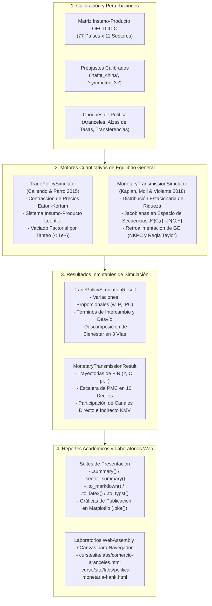

> 🇬🇧 [English](../policy_simulators.md) · 🇪🇸 Español

# Simuladores de Política Macroeconómica y Laboratorios Interactivos para Navegador

`puremacro` ofrece una suite de simulación cuantitativa de grado de producción con arquitectura dual, concebida para la investigación de frontera, el análisis de política económica y la docencia interactiva:

1. **API de Equilibrio General en Python (`puremacro.models`)**:
   - **`TradePolicySimulator`**: Modelo de equilibrio general cuantitativo ricardiano multisectorial y multipaís basado en **Caliendo y Parro (2015, *Review of Economic Studies*)**. Resuelve contrafactuales mediante álgebra exacta de sombreros (*exact hat algebra*) para perturbaciones arancelarias bilaterales, términos de intercambio, cascadas de costos intermedios insumo-producto y descomposición analítica del bienestar con verificación rigurosa de vaciado de mercados ($\max_i |X_i - (Y_i + R_i + D_i)| < 10^{-6}$).
   - **`MonetaryTransmissionSimulator`**: Comparación lado a lado entre modelos **Neokeynesianos de Agentes Heterogéneos (HANK)** y de **Agente Representativo (RANK)**, implementando la descomposición de canales directo e indirecto de **Kaplan, Moll y Violante (2018, *American Economic Review*)** a través de la escalera empírica de Propensión Marginal a Consumir (PMC) por deciles de riqueza.
2. **Laboratorios Interactivos en Navegador sin Compilación (`curso/site/labs/`)**:
   - **`comercio-aranceles.html` / `.js`**: Laboratorio interactivo en tiempo real de guerra arancelaria (MEX-EE. UU.-CHN) con controles deslizantes bilaterales, solucionador de equilibrio general en JavaScript puro (< 2 ms por iteración), variaciones en términos de intercambio y visualizadores de desvío de comercio y *nearshoring*.
   - **`politica-monetaria-hank.html` / `.js`**: Laboratorio interactivo de transmisión monetaria HANK vs. RANK con distribución de PMC por deciles y descomposición dinámica de canales KMV.
   - Diseñados para funcionamiento 100% fuera de línea, sin dependencias de Node.js ni pasos de construcción (*zero-build*), y con soporte táctil nativo en iPad y JupyterLite/Pyodide.

Ambos simuladores utilizan contenedores inmutables (*frozen dataclasses*) y disponen de suites de exportación multiformato (`.summary()`, `.plot()`, `.to_markdown()`, `.to_latex()`, `.to_typst()`).

---

## Arquitectura y Flujo de Simulación



---

## 1. Simulador de Política Comercial Cuantitativa (`TradePolicySimulator`)

### 1.1 Marco Teórico: Modelo de Equilibrio General de Caliendo y Parro (2015)

Considere una economía global con $N$ países ($n, i \in \{1, \dots, N\}$) y $J$ sectores ($j, k \in \{1, \dots, J\}$). La producción en el país $n$ y sector $j$ combina trabajo $L_{n, j}$ con canastas de insumos intermedios de todos los sectores bajo rendimientos constantes a escala.

Empleando el método de **Álgebra Exacta de Sombreros (*Exact Hat Algebra*)** (Dekle, Eaton y Kortum 2007; Caliendo y Parro 2015), los cambios contrafactuales de equilibrio en salarios, precios y flujos comerciales se expresan en variaciones proporcionales $\hat{x} \equiv x' / x$, prescindiendo de la necesidad de estimar niveles no observables de tecnología o costos comerciales tipo *iceberg*.

Ante variaciones contrafactuales en los aranceles brutos bilaterales $\hat{\tau}_{ni}^j = \frac{1 + t_{ni}'^j}{1 + t_{ni}^j}$:

1. **Variación de Costos Unitarios de Producción**:
   $$\hat{c}_n^j = \hat{w}_n^{\gamma_n^j} \prod_{k=1}^J \left( \hat{P}_n^k \right)^{\gamma_n^{j, k}}$$
   donde $\gamma_n^j > 0$ es la participación del valor agregado y $\gamma_n^{j, k} \ge 0$ es la participación del insumo intermedio $k$ en el sector $j$ ($\gamma_n^j + \sum_{k=1}^J \gamma_n^{j, k} = 1$).

2. **Índices de Precios Sectoriales (Mapeo de Contracción No Lineal)**:
   $$\hat{P}_n^j = \left( \sum_{i=1}^N \pi_{ni}^j \left( \hat{c}_i^j \hat{\tau}_{ni}^j \right)^{-\theta_j} \right)^{-\frac{1}{\theta_j}}$$
   donde $\pi_{ni}^j$ es la cuota de mercado observada de las importaciones del país $n$ provenientes del país $i$ en el sector $j$, y $\theta_j > 0$ es la elasticidad comercial sectorial.

3. **Cuotas de Comercio Bilateral Contrafactuales**:
   $$\pi_{ni}'^j = \pi_{ni}^j \left( \frac{\hat{c}_i^j \hat{\tau}_{ni}^j}{\hat{P}_n^j} \right)^{-\theta_j}$$

4. **Sistema Insumo-Producto Leontief de Gasto**:
   Dados los nuevos aranceles $\tau'$, las cuotas $\pi'$ y los salarios $\hat{w}$, el gasto sectorial $X_n'^j$ resuelve el sistema lineal:
   $$X_n'^j = \alpha_n^j \left( \hat{w}_n w_n L_n + R_n' + D_n \right) + \sum_{k=1}^J \gamma_n^{k, j} \sum_{m=1}^N \frac{\pi_{mn}'^k}{\tau_{mn}'^k} X_m'^k$$
   donde $\alpha_n^j$ es la proporción de consumo final, $D_n$ es el déficit comercial y $R_n'$ es la recaudación arancelaria contrafactual:
   $$R_n' = \sum_{j=1}^J \sum_{i=1}^N \frac{\tau_{ni}'^j - 1}{\tau_{ni}'^j} \pi_{ni}'^j X_n'^j$$

5. **Vaciado de Mercados de Bienes y Factores**:
   El producto bruto sectorial satisface la demanda mundial:
   $$Y_n'^j = \sum_{m=1}^N \frac{\pi_{mn}'^j}{\tau_{mn}'^j} X_m'^j$$
   Los salarios de equilibrio $\hat{w}_n$ se resuelven iterativamente por tanteo amortiguado (*damped tatonnement*) hasta satisfacer la cota Walrasiana:
   $$\max_n \left| \sum_{j=1}^J \gamma_n^j Y_n'^j - \hat{w}_n w_n L_n \right| < 10^{-6}$$

### 1.2 Términos de Intercambio y Descomposición Exacta del Bienestar

El índice de variación en los términos de intercambio $\widehat{\text{ToT}}_n \equiv \hat{P}_n^X / \hat{P}_n^M$ refleja el poder adquisitivo externo del país $n$:
- **Índice de Precios de Exportación**: $\hat{P}_n^X = \sum_j \sum_{m \ne n} \omega_{n, m}^j \hat{c}_n^j$
- **Índice de Precios de Importación**: $\hat{P}_n^M = \sum_j \sum_{m \ne n} \mu_{n, m}^j (\hat{c}_m^j \hat{\tau}_{nm}^j)$

El cambio total en el bienestar real $\Delta \ln \mathcal{W}_n = \ln \left( \frac{\hat{I}_n}{\hat{P}_n} \right)$ se descompone analíticamente en tres canales económicos:
$$\Delta \ln \mathcal{W}_n = \underbrace{\sum_{j=1}^J \frac{\alpha_n^j}{\theta_j} \ln \left( \frac{\pi_{nn}^j}{\pi_{nn}'^j} \right)}_{\text{Términos de Intercambio}} + \underbrace{\sum_{j=1}^J \frac{\alpha_n^j (1 - \gamma_n^j)}{\gamma_n^j \theta_j} \ln \left( \frac{\pi_{nn}^j}{\pi_{nn}'^j} \right)}_{\text{Multiplicador Insumo-Producto}} + \underbrace{\Delta \text{Recaudación Arancelaria}_n}_{\text{Efecto Fiscal}}$$

### 1.3 Recetas Prácticas en Python

#### Receta 1: Arancel Bilateral y Desvío de Comercio (EE. UU. contra China)
```python
import numpy as np
from puremacro.models import TradePolicySimulator

# Cargar el preajuste canónico de 3 países y 2 sectores (MEX, USA, CHN)
sim = TradePolicySimulator.from_preset("nafta_china")

# Inspeccionar dimensiones y claves
print(f"Países: {sim.country_codes} (N={sim.N}), Sectores: {sim.sector_codes} (J={sim.J})")

# Simular un arancel unilateral del 25% de EE. UU. a las manufacturas chinas
res = sim.simulate_bilateral_tariff(
    importer="USA",
    exporter="CHN",
    tariff_rate=0.25,
    sector="Manufactures",
    tol=1e-10,
)

print(repr(res))
# Salida: TradePolicySimulationResult(countries=['MEX', 'USA', 'CHN'], status='converged', iterations=24, residual=3.12e-11)

# Resumen a nivel país
print(res.summary())

# Acceso directo a los resultados de un país por clave o índice
res_usa = res["USA"]
res_mex = res.country("MEX")
print(f"Recaudación arancelaria de EE. UU.: {res_usa['tariff_revenue_prime']:.2f}")
print(f"Ganancia de bienestar en México (Desvío de comercio): +{res_mex['welfare_pct']:.3f}%")
```

#### Receta 2: Guerra Arancelaria Recíproca Multilateral
```python
# Simular escalada arancelaria entre la Coalición A (EE. UU.) y la Coalición B (México y China)
res_guerra = sim.simulate_trade_war(
    coalition_a=["USA"],
    coalition_b=["MEX", "CHN"],
    tariff_rate_a=0.30,   # EE. UU. impone 30% a ambos
    tariff_rate_b=0.20,   # Represalia del 20% a EE. UU.
    tol=1e-10,
)

# Exportar tabla formateada para Typst o LaTeX
print(res_guerra.to_typst())

# Generar gráfico de barras de impacto en bienestar
fig = res_guerra.plot(kind="welfare", figsize=(8.0, 4.5))
fig.savefig("guerra_arancelaria_bienestar.png", dpi=300)
```

---

## 2. Simulador de Transmisión Monetaria y Macroprudencial (`MonetaryTransmissionSimulator`)

### 2.1 Marco Teórico: HANK frente a RANK

Los modelos Neokeynesianos de Agente Representativo (RANK) tradicionales asumen que la política monetaria opera predominantemente mediante el **canal directo de sustitución intertemporal**: hogares idénticos sin restricciones de liquidez ajustan su consumo a lo largo de una única ecuación de Euler ($c_t = \mathbb{E}_t c_{t+1} - \frac{1}{\gamma} (i_t - \mathbb{E}_t \pi_{t+1})$).

Por el contrario, los modelos HANK (Kaplan, Moll y Violante 2018; Auclert et al. 2021) incorporan riesgo idiosincrásico no asegurable y restricciones crediticias ($a' \ge 0$). Una porción sustancial de los hogares vive al día (*hand-to-mouth*), registrando elevadas Propensiones Marginales a Consumir (PMC) respecto al ingreso corriente.

En consecuencia, el **canal indirecto de equilibrio general**—que se transmite a través de la demanda de trabajo, el producto agregado y los salarios netos—explica la mayor parte de la respuesta macroeconómica del consumo.

### 2.2 Descomposición de Kaplan-Moll-Violante (2018) en el Espacio de Secuencias

A través del álgebra de matrices jacobianas en el espacio de secuencias, el vector de respuesta del consumo agregado $d\mathbf{C} \in \mathbb{R}^T$ en un horizonte de $T$ trimestres se descompone en:

$$d\mathbf{C} = \underbrace{\mathbf{J}^{C, r} \, d\mathbf{r}}_{\text{Canal Directo (Sustitución)}} + \underbrace{\mathbf{J}^{C, Y} \, d\mathbf{Y}}_{\text{Canal Indirecto (Ingreso de Equilibrio General)}}$$

donde $\mathbf{J}^{C, r} \equiv \frac{\partial \mathbf{C}}{\partial \mathbf{r}}$ y $\mathbf{J}^{C, Y} \equiv \frac{\partial \mathbf{C}}{\partial \mathbf{Y}}$ son matrices cuadradas $T \times T$.

En equilibrio general, la curva de Phillips Neokeynesiana y la regla de Taylor en el espacio de secuencias determinan:
$$d\boldsymbol{\pi} = \mathbf{K}_\pi d\mathbf{Y}, \quad d\mathbf{r} = \mathbf{M}_{r, Y} d\mathbf{Y} + d\boldsymbol{\epsilon}$$

Sustituyendo en el bloque de hogares se obtiene el sistema lineal de equilibrio general:
$$\left( \mathbf{I} - \mathbf{J}^{C, Y} - \mathbf{J}^{C, r} \mathbf{M}_{r, Y} \right) d\mathbf{Y} = \mathbf{J}^{C, r} d\boldsymbol{\epsilon}$$

| Dimensión | Economía RANK | Economía HANK |
|---|---|---|
| **Estructura de Mercados** | Mercados de activos completos | Mercados incompletos, restricción crediticia $a' \ge 0$ |
| **Distribución de la PMC** | Uniforme en deciles: $1 - \beta \approx 0.015$ | Pendiente pronunciada: Decil 1 ($>0.40$) al Decil 10 ($<0.06$) |
| **Participación Canal Directo** | Idénticamente $100\%$ | $20\% - 40\%$ |
| **Participación Canal Indirecto** | Idénticamente $0\%$ | $60\% - 80\%$ |
| **Núcleo de Propagación** | Ecuación de Euler intertemporal | Multiplicador de ingreso laboral en equilibrio general |

### 2.3 Recetas Prácticas en Python

#### Receta 3: Alza de Tasa de Política Monetaria (25 bps)
```python
from puremacro.models import MonetaryTransmissionSimulator

# Instanciar simulador con parámetros de malla continua
sim_mon = MonetaryTransmissionSimulator(
    beta=0.985,
    gamma=1.0,
    r_ss=0.01,
    phi_pi=1.5,
    kappa=0.1,
    n_a=50,
    a_max=30.0,
)

# PMC agregada en estado estacionario
print(f"PMC Agregada HANK: {sim_mon.steady_state_mpc:.4f}")

# Simular alza de 25 bps con persistencia rho=0.7 en 40 trimestres
res_mon = sim_mon.simulate_rate_shock(magnitude=0.0025, rho=0.7, T=40)

print(repr(res_mon))
# Salida: MonetaryTransmissionResult(shock_type='rate', magnitude=+0.0025, T=40, mpc_hank=0.1582, mpc_rank=0.0150, indirect_share_hank=68.4%)

# Resumen comparativo en texto
print(res_mon.summary())

# Respuestas pico
picos = res_mon.peak_responses()
print(f"Caída máxima de producto en HANK: {picos['output_hank']*100:.3f}%")
print(f"Caída máxima de producto en RANK: {picos['output_rank']*100:.3f}%")

# Gráfica de 4 paneles para publicación (FIR, escalera de PMC, canales KMV)
fig = res_mon.plot(kind="all", figsize=(12.0, 8.5))
fig.savefig("transmision_monetaria_hank_rank.png", dpi=300)
```

#### Receta 4: Transferencias Focalizadas e Intervenciones de Hoja de Balance
```python
# Simular transferencia monetaria focalizada a hogares con restricciones crediticias
res_tf = sim_mon.simulate_balance_sheet_intervention(
    amount=1.0,
    target="borrowers",   # 25% más pobre de los hogares
    T=40,
)

print(f"Multiplicador inicial de consumo en HANK: {res_tf.irf_consumption_hank[0]:.4f}")
print(f"Multiplicador inicial de consumo en RANK: {res_tf.irf_consumption_rank[0]:.4f}")
# En HANK, los hogares con alta PMC gastan de inmediato (>10x la respuesta en RANK)
```

---

## 3. Referencia Completa de la API

### 3.1 `TradePolicySimulator`

| Método / Propiedad | Firma | Descripción |
|---|---|---|
| `country_codes` | `tuple[str, ...]` *(propiedad)* | Códigos identificadores de los países en el modelo. |
| `sector_codes` | `tuple[str, ...]` *(propiedad)* | Códigos identificadores de los sectores en el modelo. |
| `N` | `int` *(propiedad)* | Número de países en el modelo de comercio. |
| `J` | `int` *(propiedad)* | Número de sectores en el modelo de comercio. |
| `from_preset(name)` | `name: str = "nafta_china"` | Crear simulador a partir de calibración preajustada (`'nafta_china'`, `'symmetric_3c'`). |
| `from_icio(year)` | `year: int = 2021` | Crear simulador calibrado con la agregación OECD ICIO. |
| `simulate_bilateral_tariff()` | `importer, exporter, tariff_rate, sector=None, tol=1e-10` | Simular choque arancelario ad-valorem con verificación de vaciado de mercados. |
| `simulate_trade_war()` | `coalition_a, coalition_b, tariff_rate_a, tariff_rate_b=None` | Simular guerra arancelaria entre dos coaliciones sin intersección. |
| `simulate_arbitrary_tariffs()` | `tariffs_new: np.ndarray, tol=1e-10` | Simular matriz arancelaria bruta arbitraria $\tau_{ni}'^j$ de dimensiones `(J, N, N)`. |
| `simulate_tariff_counterfactual()`| `tariff_shocks: dict \| np.ndarray \| None` | Entrada contrafactual general que admite diccionarios o matrices. |

### 3.2 `TradePolicySimulationResult`

| Atributo / Método | Tipo / Firma | Descripción |
|---|---|---|
| `w_hat` | `np.ndarray (N,)` | Variación proporcional en salarios nominales $\hat{w}_n = w_n' / w_n$. |
| `P_hat` | `np.ndarray (N, J)` | Variación proporcional en índices de precios sectoriales $\hat{P}_n^j$. |
| `P_index_hat` | `np.ndarray (N,)` | Variación proporcional en índices de precios al consumidor $\hat{P}_n$. |
| `real_wage_hat` | `np.ndarray (N,)` | Variación proporcional en salarios reales $\hat{w}_n / \hat{P}_n$. |
| `terms_of_trade_hat` | `np.ndarray (N,)` | Variación en términos de intercambio $\hat{P}_n^X / \hat{P}_n^M$. |
| `welfare_pct` | `np.ndarray (N,)` | Cambio porcentual en bienestar real $(\hat{\mathcal{W}}_n - 1) \times 100$. |
| `tariff_revenue_prime`| `np.ndarray (N,)` | Recaudación arancelaria contrafactual por país $R_n'$. |
| `welfare_decomposition`| `dict[str, np.ndarray]` | Descomposición exacta: `'terms_of_trade'`, `'input_output'`, `'tariff_revenue'`. |
| `market_clearing_residual`| `float` | Máximo residual de vaciado de mercados en todos los países ($< 10^{-6}$). |
| `converged` | `bool` | Indica si el tanteo salarial convergió dentro de la tolerancia. |
| `country(code)` | `code: str \| int -> pd.Series` | Retorna la serie de resultados de equilibrio para un país específico. |
| `__getitem__(key)` | `key: str \| int -> pd.Series` | Acceso por corchetes delegando en `country(key)`. |
| `summary()` | `-> pd.DataFrame` | Tabla resumen a nivel país con los cambios de equilibrio. |
| `sector_summary()` | `-> pd.DataFrame` | Desglose detallado por país y sector de precios, gastos y producto bruto. |
| `to_markdown()` | `index=True, digits=4 -> str` | Formatea el resumen en Markdown estilo GitHub. |
| `to_latex()` | `index=True, digits=4 -> str` | Formatea el resumen en entorno `tabular` de LaTeX. |
| `to_typst()` | `index=True, digits=4 -> str` | Formatea el resumen en tabla de Typst. |
| `plot(kind)` | `kind='welfare' \| 'real_wage' \| 'terms_of_trade' \| 'wage' \| 'cpi'` | Genera gráfica de barras de contrafactuales por país. |

### 3.3 `MonetaryTransmissionSimulator`

| Método / Propiedad | Firma | Descripción |
|---|---|---|
| `steady_state_mpc` | `float` *(propiedad)* | PMC agregada de estado estacionario en la economía HANK. |
| `simulate_rate_shock()` | `magnitude=0.0025, rho=0.7, T=40` | Resolver equilibrio en espacio de secuencias HANK vs. RANK ante choque de tasas. |
| `simulate_balance_sheet_intervention()` | `amount=1.0, target='borrowers', T=40` | Simular transferencia fiscal focalizada o inyección de liquidez. |
| `simulate_transmission()` | `shock_type='rate', shock_path=None, ...` | Punto de entrada general que admite trayectorias exógenas arbitrarias. |

### 3.4 `MonetaryTransmissionResult`

| Atributo / Método | Tipo / Firma | Descripción |
|---|---|---|
| `irf_output_hank / rank` | `np.ndarray (T,)` | Trayectorias de función de impulso-respuesta del producto $d\mathbf{Y}$. |
| `irf_consumption_hank / rank` | `np.ndarray (T,)` | Trayectorias de impulso-respuesta del consumo $d\mathbf{C}$. |
| `irf_inflation_hank / rank` | `np.ndarray (T,)` | Trayectorias anualizadas de inflación $d\boldsymbol{\pi}$. |
| `irf_rate_hank / rank` | `np.ndarray (T,)` | Trayectorias de la tasa de interés real *ex-ante* $d\mathbf{r}$. |
| `mpc_deciles_hank / rank` | `pd.Series (10,)` | Propensión marginal a consumir en 10 deciles de riqueza. |
| `aggregate_mpc_hank / rank` | `float` | Propensión marginal a consumir agregada trimestral. |
| `direct_channel_hank` | `np.ndarray (T,)` | Canal directo de sustitución intertemporal KMV $\mathbf{J}^{C, r} d\mathbf{r}$. |
| `indirect_channel_hank` | `np.ndarray (T,)` | Canal indirecto de ingreso laboral KMV $\mathbf{J}^{C, Y} d\mathbf{Y}$. |
| `indirect_share_hank` | `float` | Porcentaje de la respuesta inicial de consumo explicada por el canal indirecto. |
| `peak_responses()` | `-> dict[str, float]` | Respuestas pico de producto, inflación y consumo. |
| `summary()` | `-> str` | Reporte en texto ASCII comparando los mecanismos HANK y RANK. |
| `to_frame()` | `-> pd.DataFrame` | DataFrame ordenado de trayectorias trimestrales indexado por $t \in [0, T-1]$. |
| `plot(kind)` | `kind='all' \| 'irf' \| 'mpc' \| 'kmv'` | Gráficas comparativas de transmisión HANK vs. RANK. |

---

## 4. Laboratorios Interactivos en Navegador (`curso/site/labs/`)

Además de la librería de Python, `puremacro` integra dos laboratorios totalmente interactivos ejecutados en el navegador dentro de `curso/site/labs/`. Desarrollados en HTML5, CSS3, KaTeX y Canvas sin herramientas externas, funcionan **100% fuera de línea**.

### 4.1 `comercio-aranceles.html` & `.js` (Guerra Arancelaria y Nearshoring)

- **Ubicación**: `curso/site/labs/comercio-aranceles.html` y `curso/site/labs/comercio-aranceles.js`.
- **Características**:
  * Solucionador de equilibrio general en tiempo real en JavaScript que converge en $<2$ ms por movimiento de control deslizante.
  * Controles de aranceles bilaterales: EE. UU. a China, EE. UU. a México, represalias mexicanas y chinas.
  * Descomposición estructural en vivo en términos de intercambio, enlaces insumo-producto e ingresos arancelarios.
  * Visualizador de desvío de comercio y auge de *nearshoring* en las manufacturas mexicanas.
  * Preajustes de política: *Línea Base*, *Guerra EE. UU.–China*, *Boom de Nearshoring*, *Guerra Total*.

### 4.2 `politica-monetaria-hank.html` & `.js` (Transmisión Monetaria HANK vs. RANK)

- **Ubicación**: `curso/site/labs/politica-monetaria-hank.html` y `curso/site/labs/politica-monetaria-hank.js`.
- **Características**:
  * Curvas de impulso-respuesta comparativas para producto, inflación y consumo.
  * Controles deslizantes para magnitud del choque, persistencia ($\rho$) y proporción de hogares *hand-to-mouth*.
  * Gráficos de barras que contrastan la escalera empírica de PMC por deciles frente a la línea plana del agente representativo.
  * Visualizador dinámico de las participaciones de los canales directo e indirecto de Kaplan-Moll-Violante.

### 4.3 Ejecución Local

Para servir los laboratorios de forma local sin requerir conexión a internet:

```bash
# Desde la raíz del repositorio puremacro
cd curso/site
python3 -m http.server 8000
```
Abra su navegador en `http://localhost:8000/labs/comercio-aranceles.html` o `http://localhost:8000/labs/politica-monetaria-hank.html`.

---

## Referencias

1. **Auclert, A., Bardóczy, B., Rognlie, M., y Straub, L. (2021).** "Using the Sequence-Space Jacobian to Solve and Estimate Heterogeneous-Agent Models." *Econometrica*, 89(6), 3115–3148.
2. **Caliendo, L. y Parro, F. (2015).** "Estimates of the Trade and Welfare Effects of NAFTA." *The Review of Economic Studies*, 82(1), 1–44.
3. **Dekle, R., Eaton, J., y Kortum, S. (2007).** "Unbalanced Trade." *American Economic Review*, 97(2), 351–355.
4. **Eaton, J. y Kortum, S. (2002).** "Technology, Geography, and Trade." *Econometrica*, 70(5), 1741–1779.
5. **Kaplan, G., Moll, B., y Violante, G. L. (2018).** "Monetary Policy According to HANK." *American Economic Review*, 108(3), 697–743.
