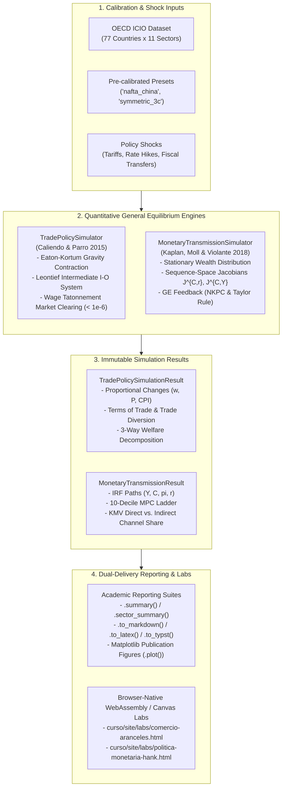

> 🇬🇧 English · 🇪🇸 [Español](es/policy_simulators.md)

# Macroeconomic Policy Simulators & Interactive Browser Labs

`puremacro` provides a production-grade, dual-delivery quantitative macroeconomic simulation suite designed for research, policy analysis, and interactive teaching:

1. **Python General Equilibrium API (`puremacro.models`)**:
   - **`TradePolicySimulator`**: Multi-country, multi-sector Ricardian general equilibrium model based on **Caliendo and Parro (2015, *Review of Economic Studies*)**. Solves exact hat algebra counterfactuals for bilateral tariff shocks, terms of trade, input-output intermediate cost cascades, and exact welfare decompositions with machine-checked goods market clearing ($\max_i |X_i - (Y_i + R_i + D_i)| < 10^{-6}$).
   - **`MonetaryTransmissionSimulator`**: Side-by-side comparative simulation of **Heterogeneous-Agent New Keynesian (HANK)** and **Representative-Agent New Keynesian (RANK)** economies, featuring the **Kaplan, Moll, and Violante (2018, *American Economic Review*)** direct versus indirect transmission decomposition across empirical Marginal Propensity to Consume (MPC) wealth deciles.
2. **Zero-Build Browser-Native Laboratories (`curso/site/labs/`)**:
   - **`comercio-aranceles.html` / `.js`**: Real-time trade war counterfactual laboratory (MEX-USA-CHN) with live bilateral tariff sliders, client-side general equilibrium solver in vanilla JavaScript (< 2 ms solve time), terms-of-trade shifts, and trade diversion visualizers.
   - **`politica-monetaria-hank.html` / `.js`**: Interactive HANK versus RANK monetary laboratory with live MPC wealth decile ladders and Kaplan-Moll-Violante direct/indirect channel curves.
   - Designed for offline operation, zero-build deployment, and native execution on tablets, iPads, and JupyterLite/Pyodide environments.

Both simulators use frozen dataclass containers and provide multi-format presentation suites (`.summary()`, `.plot()`, `.to_markdown()`, `.to_latex()`, `.to_typst()`).

---

## Architecture & Simulation Dataflow



---

## 1. Quantitative Trade Policy Simulator (`TradePolicySimulator`)

### 1.1 Theoretical Framework: Caliendo & Parro (2015)

Consider a global economy with $N$ countries ($n, i \in \{1, \dots, N\}$) and $J$ sectors ($j, k \in \{1, \dots, J\}$). Production in country $n$ and sector $j$ combines labor $L_{n, j}$ with intermediate input bundles from all sectors under constant returns to scale.

Using **Exact Hat Algebra** (Dekle, Eaton, and Kortum 2007; Caliendo and Parro 2015), counterfactual equilibrium changes in wages, prices, and trade flows are expressed in proportional terms $\hat{x} \equiv x' / x$, bypassing the need to estimate unobserved structural productivities or baseline iceberg trade costs.

Given counterfactual bilateral gross tariff changes $\hat{\tau}_{ni}^j = \frac{1 + t_{ni}'^j}{1 + t_{ni}^j}$:

1. **Unit Cost Changes**:
   $$\hat{c}_n^j = \hat{w}_n^{\gamma_n^j} \prod_{k=1}^J \left( \hat{P}_n^k \right)^{\gamma_n^{j, k}}$$
   where $\gamma_n^j > 0$ is the value-added share and $\gamma_n^{j, k} \ge 0$ is the intermediate input cost share ($\gamma_n^j + \sum_{k=1}^J \gamma_n^{j, k} = 1$).

2. **Sectoral Price Indices (Nonlinear Contraction Mapping)**:
   $$\hat{P}_n^j = \left( \sum_{i=1}^N \pi_{ni}^j \left( \hat{c}_i^j \hat{\tau}_{ni}^j \right)^{-\theta_j} \right)^{-\frac{1}{\theta_j}}$$
   where $\pi_{ni}^j$ is the baseline trade share of country $n$ on imports from country $i$ in sector $j$, and $\theta_j > 0$ is the sectoral trade elasticity.

3. **Counterfactual Bilateral Trade Shares**:
   $$\pi_{ni}'^j = \pi_{ni}^j \left( \frac{\hat{c}_i^j \hat{\tau}_{ni}^j}{\hat{P}_n^j} \right)^{-\theta_j}$$

4. **Leontief Intermediate Input-Output Expenditure System**:
   Given counterfactual tariffs $\tau'$, trade shares $\pi'$, and wages $\hat{w}$, total expenditure $X_n'^j$ solves the linear system:
   $$X_n'^j = \alpha_n^j \left( \hat{w}_n w_n L_n + R_n' + D_n \right) + \sum_{k=1}^J \gamma_n^{k, j} \sum_{m=1}^N \frac{\pi_{mn}'^k}{\tau_{mn}'^k} X_m'^k$$
   where $\alpha_n^j$ is the final consumption expenditure share, $D_n$ is the national trade deficit, and $R_n'$ is counterfactual tariff revenue:
   $$R_n' = \sum_{j=1}^J \sum_{i=1}^N \frac{\tau_{ni}'^j - 1}{\tau_{ni}'^j} \pi_{ni}'^j X_n'^j$$

5. **Goods and Factor Market Clearing**:
   Gross sectoral output equals world demand:
   $$Y_n'^j = \sum_{m=1}^N \frac{\pi_{mn}'^j}{\tau_{mn}'^j} X_m'^j$$
   Equilibrium wages $\hat{w}_n$ are solved iteratively via damped tatonnement until excess factor demand satisfies:
   $$\max_n \left| \sum_{j=1}^J \gamma_n^j Y_n'^j - \hat{w}_n w_n L_n \right| < 10^{-6}$$

### 1.2 Terms of Trade & Exact Welfare Decomposition

The terms-of-trade index change $\widehat{\text{ToT}}_n \equiv \hat{P}_n^X / \hat{P}_n^M$ reflects the price of country $n$'s exports relative to its imports:
- **Export Price Index Change**: $\hat{P}_n^X = \sum_j \sum_{m \ne n} \omega_{n, m}^j \hat{c}_n^j$
- **Import Price Index Change**: $\hat{P}_n^M = \sum_j \sum_{m \ne n} \mu_{n, m}^j (\hat{c}_m^j \hat{\tau}_{nm}^j)$

The overall change in real welfare $\Delta \ln \mathcal{W}_n = \ln \left( \frac{\hat{I}_n}{\hat{P}_n} \right)$ decomposes exactly into three economic mechanisms:
$$\Delta \ln \mathcal{W}_n = \underbrace{\sum_{j=1}^J \frac{\alpha_n^j}{\theta_j} \ln \left( \frac{\pi_{nn}^j}{\pi_{nn}'^j} \right)}_{\text{Terms of Trade}} + \underbrace{\sum_{j=1}^J \frac{\alpha_n^j (1 - \gamma_n^j)}{\gamma_n^j \theta_j} \ln \left( \frac{\pi_{nn}^j}{\pi_{nn}'^j} \right)}_{\text{Input-Output Multiplier}} + \underbrace{\Delta \text{Tariff Revenue}_n}_{\text{Fiscal Effect}}$$

### 1.3 Python Usage & Counterfactual Recipes

#### Recipe 1: Bilateral Tariff & Trade Diversion (USA vs China)
```python
import numpy as np
from puremacro.models import TradePolicySimulator

# Load pre-calibrated 3-country, 2-sector model (MEX, USA, CHN)
sim = TradePolicySimulator.from_preset("nafta_china")

# Inspect dimensions and identifiers
print(f"Countries: {sim.country_codes} (N={sim.N}), Sectors: {sim.sector_codes} (J={sim.J})")

# Simulate a unilateral 25% tariff by the US on Chinese manufactures
res = sim.simulate_bilateral_tariff(
    importer="USA",
    exporter="CHN",
    tariff_rate=0.25,
    sector="Manufactures",
    tol=1e-10,
)

print(repr(res))
# Output: TradePolicySimulationResult(countries=['MEX', 'USA', 'CHN'], status='converged', iterations=24, residual=3.12e-11)

# Country-level summary
print(res.summary())

# Access specific country outcomes via code or indexing
usa_results = res["USA"]
mex_results = res.country("MEX")
print(f"US Tariff Revenue: {usa_results['tariff_revenue_prime']:.2f}")
print(f"Mexico Welfare Gain (Trade Diversion): +{mex_results['welfare_pct']:.3f}%")
```

#### Recipe 2: Reciprocal Multi-Party Trade War
```python
# Simulate an escalating trade war between Coalition A (USA) and Coalition B (MEX, CHN)
res_war = sim.simulate_trade_war(
    coalition_a=["USA"],
    coalition_b=["MEX", "CHN"],
    tariff_rate_a=0.30,   # US imposes 30% tariffs on both
    tariff_rate_b=0.20,   # Retaliatory 20% tariff on the US
    tol=1e-10,
)

# Export LaTeX table for paper inclusion
print(res_war.to_latex())

# Generate publication-quality bar chart of welfare impacts
fig = res_war.plot(kind="welfare", figsize=(8.0, 4.5))
fig.savefig("trade_war_welfare.png", dpi=300)
```

---

## 2. Monetary & Macroprudential Transmission Simulator (`MonetaryTransmissionSimulator`)

### 2.1 Theoretical Framework: HANK vs. RANK

Textbook Representative-Agent New Keynesian (RANK) models dictate that monetary policy transmits almost exclusively via the **direct intertemporal substitution channel**: identical unconstrained households adjust savings along a single Euler equation ($c_t = \mathbb{E}_t c_{t+1} - \frac{1}{\gamma} (i_t - \mathbb{E}_t \pi_{t+1})$).

In contrast, Heterogeneous-Agent New Keynesian (HANK) models (Kaplan, Moll, and Violante 2018; Auclert et al. 2021) incorporate uninsurable idiosyncratic productivity risk and borrowing constraints. A large share of households are **hand-to-mouth** (either poor hand-to-mouth with zero net worth, or wealthy hand-to-mouth with illiquid assets), exhibiting high marginal propensities to consume (MPCs) out of current income.

Consequently, the **indirect general equilibrium channel**—transmitted through labor demand, aggregate output, and disposable income—drives the dominant share of consumption movements.

### 2.2 Kaplan-Moll-Violante (2018) Sequence-Space Decomposition

Using the sequence-space Jacobian methodology (Auclert, Bardóczy, Rognlie, and Straub 2021), the aggregate consumption response vector $d\mathbf{C} \in \mathbb{R}^T$ over horizon $T$ is decomposed into:

$$d\mathbf{C} = \underbrace{\mathbf{J}^{C, r} \, d\mathbf{r}}_{\text{Direct Channel (Substitution)}} + \underbrace{\mathbf{J}^{C, Y} \, d\mathbf{Y}}_{\text{Indirect Channel (GE Income)}}$$

where $\mathbf{J}^{C, r} \equiv \frac{\partial \mathbf{C}}{\partial \mathbf{r}}$ and $\mathbf{J}^{C, Y} \equiv \frac{\partial \mathbf{C}}{\partial \mathbf{Y}}$ are $T \times T$ sequence-space Jacobian matrices.

In general equilibrium, the New Keynesian Phillips Curve and Taylor rule define:
$$d\boldsymbol{\pi} = \mathbf{K}_\pi d\mathbf{Y}, \quad d\mathbf{r} = \mathbf{M}_{r, Y} d\mathbf{Y} + d\boldsymbol{\epsilon}$$

Substituting into the household block yields the sequence-space general equilibrium solve:
$$\left( \mathbf{I} - \mathbf{J}^{C, Y} - \mathbf{J}^{C, r} \mathbf{M}_{r, Y} \right) d\mathbf{Y} = \mathbf{J}^{C, r} d\boldsymbol{\epsilon}$$

| Dimension | RANK Economy | HANK Economy |
|---|---|---|
| **Market Structure** | Complete asset markets | Incomplete markets, borrowing constraint $a' \ge 0$ |
| **Household MPCs** | Uniform across deciles: $1 - \beta \approx 0.015$ | Steep gradient: Decile 1 ($>0.40$) to Decile 10 ($<0.06$) |
| **Direct Channel Share** | Identically $100\%$ | $20\% - 40\%$ |
| **Indirect Channel Share** | Identically $0\%$ | $60\% - 80\%$ |
| **Propagation Core** | Intertemporal Euler equation | General equilibrium labor income multiplier |

### 2.3 Python Usage & Transmission Recipes

#### Recipe 3: Monetary Policy Tightening (25 bps Hike)
```python
from puremacro.models import MonetaryTransmissionSimulator

# Initialize simulator with continuous asset grid parameters
sim_mon = MonetaryTransmissionSimulator(
    beta=0.985,
    gamma=1.0,
    r_ss=0.01,
    phi_pi=1.5,
    kappa=0.1,
    n_a=50,
    a_max=30.0,
)

# Steady-state aggregate MPC
print(f"HANK Steady-State MPC: {sim_mon.steady_state_mpc:.4f}")

# Simulate a 25 bps rate hike with persistence rho=0.7 over 40 quarters
res_mon = sim_mon.simulate_rate_shock(magnitude=0.0025, rho=0.7, T=40)

print(repr(res_mon))
# Output: MonetaryTransmissionResult(shock_type='rate', magnitude=+0.0025, T=40, mpc_hank=0.1582, mpc_rank=0.0150, indirect_share_hank=68.4%)

# Display comprehensive side-by-side summary
print(res_mon.summary())

# Extract peak responses
peaks = res_mon.peak_responses()
print(f"HANK Peak Output Contraction: {peaks['output_hank']*100:.3f}%")
print(f"RANK Peak Output Contraction: {peaks['output_rank']*100:.3f}%")

# 4-panel publication visualization (IRFs, MPC ladder, KMV channels)
fig = res_mon.plot(kind="all", figsize=(12.0, 8.5))
fig.savefig("monetary_transmission_hank_rank.png", dpi=300)
```

#### Recipe 4: Targeted Balance-Sheet & Fiscal Transfers
```python
# Simulate a targeted cash transfer to liquidity-constrained hand-to-mouth households
res_tf = sim_mon.simulate_balance_sheet_intervention(
    amount=1.0,
    target="borrowers",   # Poorest 25% of households
    T=40,
)

print(f"Initial Consumption Multiplier in HANK: {res_tf.irf_consumption_hank[0]:.4f}")
print(f"Initial Consumption Multiplier in RANK: {res_tf.irf_consumption_rank[0]:.4f}")
# In HANK, high-MPC borrowers spend immediately (>10x the response in RANK)
```

---

## 3. Comprehensive API Reference

### 3.1 `TradePolicySimulator`

| Method / Property | Signature | Description |
|---|---|---|
| `country_codes` | `tuple[str, ...]` *(property)* | Tuple of country identifier codes in the model. |
| `sector_codes` | `tuple[str, ...]` *(property)* | Tuple of sector identifier codes in the model. |
| `N` | `int` *(property)* | Number of countries in the trade model. |
| `J` | `int` *(property)* | Number of sectors in the trade model. |
| `from_preset(name)` | `name: str = "nafta_china"` | Instantiate simulator from pre-calibrated baseline (`'nafta_china'`, `'symmetric_3c'`). |
| `from_icio(year)` | `year: int = 2021` | Instantiate simulator from OECD ICIO benchmark aggregation. |
| `simulate_bilateral_tariff()` | `importer, exporter, tariff_rate, sector=None, tol=1e-10` | Simulate ad-valorem bilateral tariff shock with market clearing verification. |
| `simulate_trade_war()` | `coalition_a, coalition_b, tariff_rate_a, tariff_rate_b=None` | Simulate bilateral or multi-party trade war between two non-overlapping coalitions. |
| `simulate_arbitrary_tariffs()` | `tariffs_new: np.ndarray, tol=1e-10` | Simulate arbitrary gross bilateral tariff matrix $\tau_{ni}'^j$ of shape `(J, N, N)`. |
| `simulate_tariff_counterfactual()`| `tariff_shocks: dict \| np.ndarray \| None` | Flexible counterfactual interface accepting dict mappings or array inputs. |

### 3.2 `TradePolicySimulationResult`

| Attribute / Method | Type / Signature | Description |
|---|---|---|
| `w_hat` | `np.ndarray (N,)` | Proportional change in nominal wages $\hat{w}_n = w_n' / w_n$. |
| `P_hat` | `np.ndarray (N, J)` | Proportional change in sectoral price indices $\hat{P}_n^j$. |
| `P_index_hat` | `np.ndarray (N,)` | Proportional change in consumer price indices $\hat{P}_n$. |
| `real_wage_hat` | `np.ndarray (N,)` | Proportional change in real wages $\hat{w}_n / \hat{P}_n$. |
| `terms_of_trade_hat` | `np.ndarray (N,)` | Proportional change in terms of trade index $\hat{P}_n^X / \hat{P}_n^M$. |
| `welfare_pct` | `np.ndarray (N,)` | Percentage change in real income / welfare $(\hat{\mathcal{W}}_n - 1) \times 100$. |
| `tariff_revenue_prime`| `np.ndarray (N,)` | Counterfactual tariff revenue collection by country $R_n'$. |
| `welfare_decomposition`| `dict[str, np.ndarray]` | Exact decomposition: `'terms_of_trade'`, `'input_output'`, `'tariff_revenue'`. |
| `market_clearing_residual`| `float` | Maximum goods and factor market clearing residual across countries ($< 10^{-6}$). |
| `converged` | `bool` | Whether wage tatonnement converged within tolerance. |
| `country(code)` | `code: str \| int -> pd.Series` | Return the equilibrium outcome series for a specific country. |
| `__getitem__(key)` | `key: str \| int -> pd.Series` | Subscript access delegating to `country(key)`. |
| `summary()` | `-> pd.DataFrame` | Country-level summary table of equilibrium changes. |
| `sector_summary()` | `-> pd.DataFrame` | Detailed country-sector breakdown of prices, expenditures, and gross outputs. |
| `to_markdown()` | `index=True, digits=4 -> str` | Format summary table as GitHub-flavored Markdown. |
| `to_latex()` | `index=True, digits=4 -> str` | Format summary table as LaTeX tabular environment. |
| `to_typst()` | `index=True, digits=4 -> str` | Format summary table as Typst table. |
| `plot(kind)` | `kind='welfare' \| 'real_wage' \| 'terms_of_trade' \| 'wage' \| 'cpi'` | Plot counterfactual bar chart by country. |

### 3.3 `MonetaryTransmissionSimulator`

| Method / Property | Signature | Description |
|---|---|---|
| `steady_state_mpc` | `float` *(property)* | Steady-state aggregate quarterly MPC in HANK economy. |
| `simulate_rate_shock()` | `magnitude=0.0025, rho=0.7, T=40` | Solve HANK vs. RANK sequence-space equilibrium for an interest rate shock. |
| `simulate_balance_sheet_intervention()` | `amount=1.0, target='borrowers', T=40` | Simulate targeted fiscal transfer or balance-sheet injection. |
| `simulate_transmission()` | `shock_type='rate', shock_path=None, ...` | General simulation entry point supporting custom exogenous shock paths. |

### 3.4 `MonetaryTransmissionResult`

| Attribute / Method | Type / Signature | Description |
|---|---|---|
| `irf_output_hank / rank` | `np.ndarray (T,)` | Output impulse response paths $d\mathbf{Y}$. |
| `irf_consumption_hank / rank` | `np.ndarray (T,)` | Consumption impulse response paths $d\mathbf{C}$. |
| `irf_inflation_hank / rank` | `np.ndarray (T,)` | Annualized inflation impulse response paths $d\boldsymbol{\pi}$. |
| `irf_rate_hank / rank` | `np.ndarray (T,)` | Ex-ante real interest rate paths $d\mathbf{r}$. |
| `mpc_deciles_hank / rank` | `pd.Series (10,)` | Marginal propensity to consume across 10 wealth deciles. |
| `aggregate_mpc_hank / rank` | `float` | Aggregate quarterly economy-wide MPC. |
| `direct_channel_hank` | `np.ndarray (T,)` | KMV direct intertemporal substitution channel $\mathbf{J}^{C, r} d\mathbf{r}$. |
| `indirect_channel_hank` | `np.ndarray (T,)` | KMV indirect general equilibrium labor income channel $\mathbf{J}^{C, Y} d\mathbf{Y}$. |
| `indirect_share_hank` | `float` | Percentage share of date-0 consumption driven by indirect GE channel. |
| `peak_responses()` | `-> dict[str, float]` | Peak responses for output, inflation, and consumption. |
| `summary()` | `-> str` | Formatted ASCII report comparing HANK and RANK mechanisms. |
| `to_frame()` | `-> pd.DataFrame` | Tidy quarterly path DataFrame indexed by quarter $t \in [0, T-1]$. |
| `plot(kind)` | `kind='all' \| 'irf' \| 'mpc' \| 'kmv'` | Comparative HANK vs. RANK transmission figures. |

---

## 4. Interactive WebAssembly / Browser Labs (`curso/site/labs/`)

In addition to the Python library, `puremacro` bundles two fully interactive, client-side browser laboratories located in `curso/site/labs/`. Built using vanilla HTML5, CSS3, KaTeX, and HTML Canvas, they require **zero compilation**, **zero node_modules**, and operate 100% offline.

### 4.1 `comercio-aranceles.html` & `.js` (Trade War & Nearshoring Lab)

- **Path**: `curso/site/labs/comercio-aranceles.html` and `curso/site/labs/comercio-aranceles.js`.
- **Core Features**:
  * Real-time general equilibrium solver in client-side JavaScript executing in $<2$ ms per slider adjustment.
  * Interactive bilateral tariff controls: US on China, US on Mexico, Mexican retaliation, Chinese retaliation.
  * Live structural decomposition into terms of trade, input-output linkages, and fiscal tariff revenues.
  * Visualizer for trade diversion and nearshoring effects toward Mexican manufacturing.
  * Pre-configured policy presets: *Baseline*, *US–China Trade War*, *Nearshoring Boom*, *All-Out Trade War*.

### 4.2 `politica-monetaria-hank.html` & `.js` (HANK vs. RANK Transmission Lab)

- **Path**: `curso/site/labs/politica-monetaria-hank.html` and `curso/site/labs/politica-monetaria-hank.js`.
- **Core Features**:
  * Comparative impulse response curves for output, inflation, and consumption.
  * Interactive parameter sliders for shock size, persistence ($\rho$), and the share of hand-to-mouth households.
  * Live bar charts contrasting the steep empirical MPC decile ladder against the flat representative-agent benchmark.
  * Dynamic visualizer for the Kaplan-Moll-Violante direct versus indirect transmission shares.

### 4.3 Running Locally

To run the interactive laboratories locally without any external dependencies:

```bash
# From the puremacro repository root
cd curso/site
python3 -m http.server 8000
```
Open your browser to `http://localhost:8000/labs/comercio-aranceles.html` or `http://localhost:8000/labs/politica-monetaria-hank.html`.

---

## References

1. **Auclert, A., Bardóczy, B., Rognlie, M., and Straub, L. (2021).** "Using the Sequence-Space Jacobian to Solve and Estimate Heterogeneous-Agent Models." *Econometrica*, 89(6), 3115–3148.
2. **Caliendo, L. and Parro, F. (2015).** "Estimates of the Trade and Welfare Effects of NAFTA." *The Review of Economic Studies*, 82(1), 1–44.
3. **Dekle, R., Eaton, J., and Kortum, S. (2007).** "Unbalanced Trade." *American Economic Review*, 97(2), 351–355.
4. **Eaton, J. and Kortum, S. (2002).** "Technology, Geography, and Trade." *Econometrica*, 70(5), 1741–1779.
5. **Kaplan, G., Moll, B., and Violante, G. L. (2018).** "Monetary Policy According to HANK." *American Economic Review*, 108(3), 697–743.
