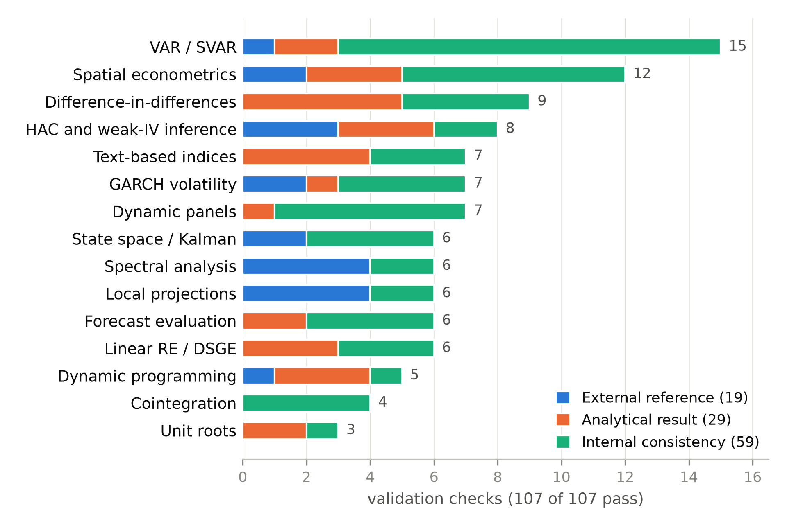

# Summary

`puremacro` is a Python library for empirical macroeconomics and quantitative
macro modeling, implemented entirely on the scientific-Python core — NumPy
[@numpy2020], SciPy [@scipy2020], pandas, and Matplotlib — with no compiled or
specialized dependencies at runtime. Because it avoids heavier libraries, it
executes unchanged in the browser through Pyodide [@pyodide], on a tablet, or in
a JupyterLite notebook, as readily as on a workstation. The library spans the
methods an applied macroeconomist reaches for: reduced-form and structural vector
autoregressions [@sims1980; @blanchardquah1989], factor-augmented VARs [@bernanke2005],
local projections [@jorda2005], ARCH/GARCH and GARCH-MIDAS volatility models [@engle1982; @bollerslev1986],
heteroskedasticity- and autocorrelation-consistent inference [@neweywest1987],
dynamic-panel and weak-instrument estimators [@andersonrubin1949; @oleapflueger2013],
difference-in-differences and synthetic control, value-function iteration,
Sequence-Space HANK general equilibrium [@auclert2021], mixed-frequency nowcasting [@giannone2008],
integrated climate macroeconomics [@nordhaus2018; @golosov2014], and text-based
uncertainty and narrative burst indices [@bbd2016].

# Statement of need

Macroeconometrics and computational macro are usually taught and practiced with
tools that demand a substantial local installation — the statsmodels
[@statsmodels2010], `arch`, and `linearmodels` stack — or commercial software,
such as MATLAB for Dynare and most heterogeneous-agent toolkits. That barrier is
invisible to well-resourced users and decisive for everyone else: students on
tablets, instructors in low-bandwidth classrooms, and researchers without budgets
or administrative rights. `puremacro` removes it. Because the library is pure
scientific-Python, a reader can open a browser and reproduce a structural VAR, a
local-projection impulse response, an Aiyagari/HANK equilibrium, or a real-time GDP
nowcast at zero cost, with nothing to install.

Breadth alone is not trustworthy, so `puremacro` ships its own evidence. A
built-in **validation gallery** contains 73 cases that continuously check the
library's estimators against independent references — statsmodels [@statsmodels2010],
`arch`, and `linearmodels` where a canonical implementation exists, and
closed-form solutions, published numbers, or internal cross-method identities
elsewhere — across thirteen subsystems (\autoref{fig:scorecard}). A companion
**replication gallery** reproduces published results from heterogeneous-agent,
SVAR, and climate-economy models. Both are wired into the CI workflows shipped with the package and
re-run in a single line, `puremacro.validation.scorecard()`, including in the
browser, so a user can verify the library on the same machine that runs it. No existing macro-econometrics
package, to our knowledge, combines this breadth with browser portability and a
continuously verified, self-contained correctness record.

# State of the field

The scientific-Python ecosystem already serves parts of this space well, and
`puremacro` is not a replacement for any of it. `statsmodels` [@statsmodels2010]
is the reference implementation for reduced-form time series and general
econometrics; `arch` covers conditional-volatility models; `linearmodels` covers
panel and instrumental-variables estimation. What none of them targets is the
*structural* macro layer — identification by sign, sign-zero, long-run, proxy or
narrative restrictions — or the solution of heterogeneous-agent equilibria. For
those, the field's standard tool is Dynare [@dynare2011], which is written for
MATLAB, and the sequence-space Jacobian method [@auclert2021], whose reference
implementation is Python but whose practical speed depends on JIT compilation.

The portability picture is more specific than "these tools are heavy", and it is
worth stating precisely. `statsmodels` is packaged for Pyodide and does run in a
browser; `arch`, `linearmodels` and `numba` are not, and the Pyodide 0.28
distribution ships none of the three. So an applied macroeconomist assembling the
usual stack finds that the conditional-volatility layer, the panel-IV layer and
the JIT layer that heterogeneous-agent codes lean on all stop at the browser
boundary, and that the DSGE layer is reached through a different language runtime
altogether.

That is the gap `puremacro` targets, and it is also the answer to *build versus
contribute*. The methods could in principle be contributed to the existing
packages one at a time. What could not be contributed is the property that makes
them usable together on a constrained machine: a single import surface that
depends on nothing outside the four-package numerical core. That is a
whole-library invariant, enforced at the boundary of every module (see below),
not a feature that can be added to somebody else's dependency graph.

# Software design

One decision organises the codebase: **a shippable module may import only NumPy,
SciPy, pandas and Matplotlib at module scope.** This is not a convention but a
tested invariant. A test walks every shippable submodule, imports it, and asserts
that no forbidden package — `statsmodels`, `linearmodels`, `arch`, and the
scraping stack — has appeared in `sys.modules`; a second test re-runs the sweep in
a subprocess with those packages made unimportable, so a module that would break
on a machine without them fails in CI on a machine that has them.

The same libraries that are forbidden at runtime are the ones the test suite
depends on. `statsmodels`, `arch` and `linearmodels` are development-only
dependencies used as **oracles**: the validation gallery estimates a model both
ways and compares. The reference implementations therefore certify the library
without ever shipping with it, which is what allows breadth and browser
portability to coexist rather than trade off.

The cost is paid in the numerical layer, where every estimator is written against
NumPy rather than delegating to a compiled kernel, and in a pattern that recurs
throughout: prefer an external tool when present, degrade to a pure-Python path
when not. Seasonal adjustment uses the X-13ARIMA-SEATS binary where it is
installed and falls back to an in-package X-11/ARIMA engine where it is not;
data fetchers return an empty frame rather than raising when no HTTP stack
exists, so a notebook carrying a frozen snapshot reaches its offline branch. A
`runtime` module makes this explicit, detecting host, device class and the four
capabilities that actually differ away from a workstation — sockets, Parquet,
threads, and a writable filesystem — and adapting rather than failing.

The package is 606 modules and roughly 105,000 lines, checked by 6,187 tests
across 459 test files. Three release gates guard the invariants that matter
between versions: the Pyodide import contract above, a snapshot of the public API
that must be regenerated deliberately when the surface moves, and a version-sync
check across every file that records the version.

# Features

- **Time series, SVARs, and Identification:** VAR, FAVAR, BVAR (Minnesota), VECM, and TVP-VAR;
  structural identification via Cholesky, long-run (Blanchard–Quah), sign and
  sign-zero restrictions, proxy/external instruments, and narrative signs;
  impulse responses, variance decompositions, and bootstrap bands.
- **Nowcasting and Machine Learning:** mixed-frequency Dynamic Factor Models (DFM) with
  ragged-edge EM imputation and news decomposition; Elastic Net and Adaptive Lasso penalized forecasting.
- **Single-equation and Panel:** local projections (including IV and panel),
  dynamic-panel GMM, HAC and weak-instrument-robust Anderson-Rubin inference,
  synthetic difference-in-differences, and synthetic control.
- **Computational and Climate Macro:** Sequence-Space HANK general equilibrium solve,
  value-function iteration, the endogenous grid method, continuous-time HJB, and
  DICE-2016 integrated climate-economy simulations.
- **Reproducibility and Teaching:** an in-browser JupyterLite playground with 36
  bilingual (English/Spanish) interactive showcase notebooks and empirical datasets.

{ width=70% }

# Research impact

`puremacro` was built for, and is used in, a graduate macroeconomics sequence at
ITAM, where it supplies the computational half of the course: 27 lesson notebooks
in English and 21 in Spanish, each running against the library rather than
against hand-rolled scripts. The package itself ships 80 bilingual showcase
notebooks that execute in the browser, so a reader with no local installation can
re-run every result.

Its correctness record is designed to be checkable rather than asserted. The
replication gallery reproduces published findings — Huggett [-@huggett1993], the
Smets–Wouters seven-shock specification [@smetswouters2007], Okun's law
[-@okun1962], and the Aiyagari [@aiyagari1994] comparative statics on the
equilibrium interest rate — while the validation gallery's 73 cases check
estimators against `statsmodels`, `arch` and `linearmodels` where a canonical
implementation exists. Both galleries run in one line, in the browser, on the
reader's own machine.

<!-- TODO (author): the above is what I could verify from the repository and the
     course tree. Add anything external that I cannot see — other institutions
     or courses using it, working papers or theses whose results it produced,
     downstream packages, download figures. If there is none yet, say so plainly
     rather than padding; JOSS accepts a teaching-led impact case, and a young
     package that is honest about its age reviews better than one that is not. -->

# AI usage disclosure

Generative AI (Anthropic's Claude) was used as a coding assistant for parts of
this library, including portions of the quarterly-national-accounts fetch layer
and its tests, some documentation, and drafting sections of this paper. No result
reported here rests on that assistance being correct: every estimator is checked
against an independent reference in the validation gallery, the replication
gallery is checked against published numbers, and the full suite of 6,187 tests
runs on nine CI targets before any release. All AI-assisted changes were reviewed
by the author before merge.

<!-- TODO (author): confirm or narrow the scope sentence above. I can attest to
     the parts of this work I observed; only you know the full history of the
     codebase, and this disclosure should describe it accurately. -->

# Acknowledgements

The author thanks the scientific-Python and Pyodide communities, whose work makes
a browser-runnable macroeconometrics library possible.

# References
