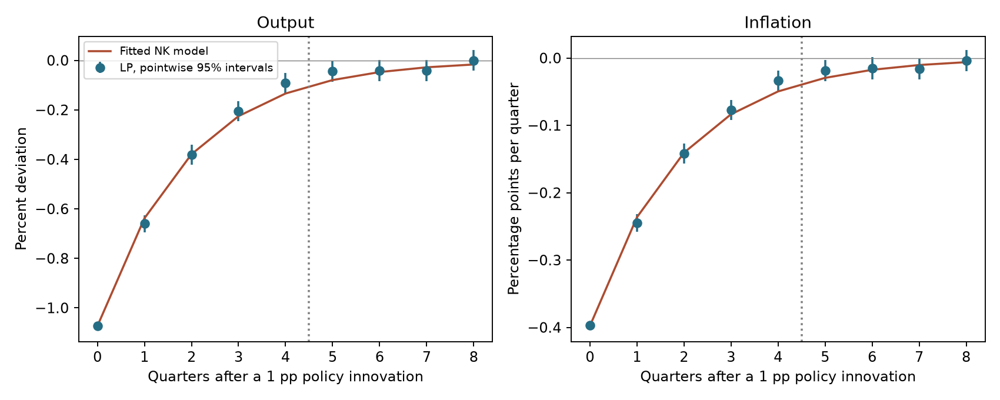
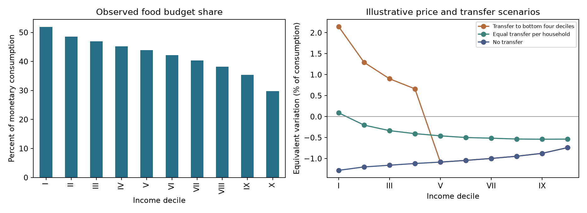

# Research workflows: fresh run

All three workflows completed successfully on 2026-10-01.

## Independent benchmarks

**6/6 passed**, including each deliberately perturbed negative control.
[Full benchmark evidence](benchmarks/benchmark_report.md).

## Empirical-to-structural application

The independently simulated New Keynesian study estimated the following
parameters using joint LP covariance. Horizons 0–4 enter the fit; horizons 5–8
are descriptive checks using the same sample.

| parameter | simulation_truth | estimate |       se |
|-----------|------------------|----------|----------|
|     sigma |              1.5 | 1.469875 | 0.059139 |
|     kappa |             0.15 | 0.152528 | 0.004758 |
|       rho |              0.6 | 0.594417 |  0.01293 |

[Report](structural/report.md) · [Manifest](structural/manifest.json)

## Distributional trade application

Six scenarios use observed INEGI ENIGH 2024 income-decile expenditure baskets.
The assumed tariff, import exposure and pass-through imply a **2.5% food-price
increase**, with unchanged cash wages. The transfer pool is externally supplied,
not estimated tariff revenue. The fixed-basket results below show equivalent
variation as a percentage of baseline consumption; positive values mean gains.

| group | bottom_four_deciles | equal_per_household | no_transfer |
|-------|---------------------|---------------------|-------------|
|     I |            2.147687 |            0.090366 |   -1.281181 |
|    II |            1.293894 |           -0.202413 |   -1.199952 |
|   III |            0.902428 |           -0.334546 |   -1.159196 |
|    IV |            0.662173 |           -0.405942 |   -1.118019 |
|     V |           -1.084721 |           -0.458436 |   -1.084721 |
|    VI |           -1.044113 |           -0.498588 |   -1.044113 |
|   VII |           -0.997442 |           -0.514262 |   -0.997442 |
|  VIII |           -0.945045 |           -0.534421 |   -0.945045 |
|    IX |           -0.875771 |           -0.539127 |   -0.875771 |
|     X |           -0.739243 |           -0.536813 |   -0.739243 |

Both transfer allocations conserve the same MXN 9.008 billion quarterly pool.
The application also exports Cobb–Douglas sensitivity results.
[Report](distributional/report.md) · [Manifest](distributional/manifest.json)

These are a synthetic structural recovery exercise and conditional trade
scenarios. They do not estimate a historical monetary-policy or tariff effect.
All logs, input data, result CSVs and source/assumption manifests are retained
in this run directory.
