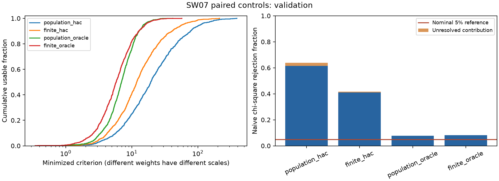

# Controlled SW07 estimator experiment

**Completed: 1,398 independent samples and 5,592 variant fits.** Exact
finite-sample expectations improve the HAC estimator in this experiment but
do not repair its chi-square reference. Fixed true-DGP covariance weights
reduce rejection distortion substantially, yet still reject 7.7–8.2% at a
nominal 5% level in independent validation. Separately calibrated simulation
cutoffs give 4.9–5.9% for the oracle variants at this one known DGP. None of
these results establishes general empirical inference or justifies replacing
the original estimator. Ordinary parameter confidence intervals remain withheld.

## Question and design

The preceding [finite-sample diagnosis](../2026-10-01-sw07-finite-sample/README.md)
found that the nominal 5% chi-square rule rejected approximately 62–64% of
samples from the fixed published calibration. This experiment crosses two
changes: correcting model moments for exact finite-sample demeaning and replacing
each sample's HAC estimate with a fixed true-DGP covariance.

| Variant | Expected model moments | Covariance for weighting |
|---|---|---|
| `population_hac` | Population central moments | Per-sample HAC8 |
| `finite_hac` | Exact expectation of the sample estimator | Per-sample HAC8 |
| `population_oracle` | Population central moments | Exact covariance at the true DGP, fixed |
| `finite_oracle` | Exact expectation of the sample estimator | Exact covariance at the true DGP, fixed |

The fixed oracle covariance is a control. It uses known generating parameters
and is not a feasible estimated weighting procedure. Exact expectations change
with candidate parameters inside the optimizer; covariance weights in the oracle
variants do not. No covariance interpolation or stochastic moment approximation
is used.

The [protocol](protocol.md) was written before scientific simulation began.
It fixes the complete rounded published calibration, true `crr=0.81` and
`em=0.24`, 156 stationary Gaussian quarters, full-sample estimated means,
a 152-quarter common product window, 15 jointly constructed moments,
nine fitted/six reserved moments, four original optimizer starts, original
bounds, tolerance 1e-9 and a 500-evaluation limit. All variants share the same
sample and full HAC matrix. All failures remain visible.

Calibration uses 399 samples and validation uses 999 new samples, for 1,398
independent samples and 5,592 variant fits. Seed 20261002 and
separate phase indices define disjoint streams, distinct from the preceding
experiment. Unit and application tests use other seeds. The installed-wheel
smoke check replays two samples per phase with the study seed; those workflow
checks are also excluded from the scientific counts. This is a development
protocol, not an externally registered plan.

## Completed calibration

| Variant | Usable / 399 | Unresolved | Nominal 5% rejection bounds | RMSE crr | RMSE em |
|---|---:|---:|---:|---:|---:|
| `population_hac` | 392 | 7 | 63.659–65.414% | 0.046751 | 0.059715 |
| `finite_hac` | 390 | 9 | 43.108–45.363% | 0.044779 | 0.050402 |
| `population_oracle` | 399 | 0 | 6.266% | 0.026523 | 0.025557 |
| `finite_oracle` | 399 | 0 | 6.266% | 0.029659 | 0.026522 |

These are calibration results, not the independent validation conclusion.
Rejection bounds treat every unresolved outcome first as a nonrejection and
then as a rejection. Parameter recovery conditions on usable fits. The complete
[calibration summary](calibration/summary.csv) includes Monte Carlo intervals,
boundaries, criterion quantiles and signed bias.

Calibration cutoffs follow the predeclared order rank `ceil(.95*(399+1))=380`
and strict rejection above that order statistic. Unresolved calibration criteria
are bounded by zero and infinity; they are never dropped. The resulting cutoff
intervals were recorded in [calibration_reference.json](calibration_reference.json)
before validation completed:

| Variant | Lower cutoff | Upper cutoff |
|---|---:|---:|
| `population_hac` | 127.97345 | 162.63170 |
| `finite_hac` | 54.63759 | 86.67580 |
| `population_oracle` | 15.28047 | 15.28047 |
| `finite_oracle` | 15.48096 | 15.48096 |

The reference records its creation time and calibration manifest/draw hashes.
It does not select a winning estimator. Validation applies all four cutoffs to
new samples using the frozen rules.

## Independent validation

All 999 validation samples completed. The table compares the nominal 5%
chi-square rule with the frozen simulation cutoffs. Ranges retain unresolved
outcomes; neither interval is a structural-parameter confidence interval.

| Variant | Unresolved / 999 | Naive chi-square rejection | 95% MC interval | Simulation-cutoff rejection bounds | Conditional 95% MC interval |
|---|---:|---:|---:|---:|---:|
| `population_hac` | 22 | 61.562–63.764% | 58.465–66.750% | 2.202–5.506% | 1.385–7.106% |
| `finite_hac` | 8 | 40.941–41.742% | 37.872–44.870% | 2.302–6.507% | 1.465–8.218% |
| `population_oracle` | 0 | 7.708% | 6.130–9.539% | 4.905% | 3.650–6.433% |
| `finite_oracle` | 0 | 8.208% | 6.581–10.086% | 5.906% | 4.526–7.552% |

Even the oracle variants have naive rejection intervals entirely above 5%.
Exact first and second moments do not establish the chi-square approximation.
There is only one usable boundary fit in each oracle variant, so boundaries
cannot explain the excess rejection. The separate simulation reference behaves
much closer to 5% at the known DGP, with both oracle intervals containing 5%.
This is conditional on the realized 399-draw calibration pool; it is not
evidence of uniformly valid composite-null inference. The wider HAC ranges
also reflect unresolved calibration cutoffs and validation fits.

| Variant | Validation RMSE crr | Validation RMSE em |
|---|---:|---:|
| `population_hac` | 0.045257 | 0.060246 |
| `finite_hac` | 0.042362 | 0.050401 |
| `population_oracle` | 0.027163 | 0.026242 |
| `finite_oracle` | 0.030080 | 0.027168 |

On the 969 common usable HAC draws, the finite-expectation correction lowers
mean squared error for both parameters. Under oracle weights, it instead
raises mean squared error for both parameters across the 999 paired usable
draws. The paired differences and their
Monte Carlo standard errors are retained in
[combined_paired_differences.csv](combined_paired_differences.csv). A correction
to the expectation is therefore not a universal improvement in parameter risk.
The interaction with weighting matters; no winning method was selected after
seeing these validation outcomes.



The [independent saved-result audit](independent_audit.md) reproduces every
summary, paired comparison and cutoff from authenticated artifacts without
importing production code. The public phase-comparison API produces the same
table, as recorded in [execution_status.json](execution_status.json). Across
both phases, all 22,368 optimizer starts report termination success and agree
within the declared objective tolerance, but **46 selected variant fits** fail
the additional first-order stationarity check. They remain unresolved: 16 in
calibration and 30 in validation. This is optimizer stationarity, not instability
of the generating DSGE dynamics. No sample or failure was replaced.

## Interpretation rules

The naive chi-square diagnostic deliberately retains otherwise usable boundary
fits. Numerical regularity alone does not establish statistical validity.
Independent validation of a simulation cutoff still occurs at one known DGP;
it does not establish a composite-null test or propagate calibration uncertainty.

Validation rejection bounds combine ambiguous calibration cutoffs with
unresolved validation fits. Binomial Monte Carlo intervals envelope both
possibilities, conditional on the realized calibration pool. They do not include
all randomness from estimating that pool's cutoff, and they are not parameter
confidence intervals. No estimator is chosen on validation data and then
described as independently validated.

Paired squared-error comparisons use the intersection of usable fits and report
the denominator and a Monte Carlo standard error. Optimizer failures can select
that subset. Neither smaller criterion values across different weight matrices
nor a single-DGP improvement establishes superior general empirical inference.

## Observed-data descriptive fits

| Variant | crr | em | Minimized criterion |
|---|---:|---:|---:|
| `population_hac` | 0.838258 | 0.254086 | 25.255410 |
| `finite_hac` | 0.875753 | 0.196029 | 27.550883 |
| `population_oracle` | 0.804625 | 0.288166 | 31.828005 |
| `finite_oracle` | 0.808546 | 0.286695 | 37.283335 |

All four observed optimizations are interior and numerically resolved. Their
differences show sensitivity to the estimator and weighting choice. Criteria
under different weights have different scales and should not be ranked as
common fit scores. The two observed oracle criteria exceed their conditional
calibration cutoffs; oracle size performance must not be confused with empirical
model adequacy. This comparison is descriptive at the specified point DGP,
not a new validated test of a composite null.

Observed data remain the authenticated revised-FRED snapshot for 1966Q1–2004Q4,
not the original paper's vintage. The published calibration overlaps the
historical sample, and its parameter uncertainty is omitted. Ordinary parameter
confidence intervals remain withheld.

## Implementation and verification

`sw07_finite_sample_expectations` uses autocovariance prefix sums to account
exactly for finite-sample mean estimation and lag orientation. It avoids the
full Gaussian fourth-moment calculation inside optimization. The
[derivation](expectation_design.md) documents the formula and controls.
Observed local timings are 2.308 ms per expectation evaluation versus
34.126 ms for expectations plus covariance, approximately 14.8 times faster.
This is a local measurement, not a cross-platform performance guarantee.

- **73 helper/experiment tests passed**, including comparisons with the dense
  exact oracle, independent VAR and IID controls, preservation of the original
  population/HAC estimator, constant oracle weights, shared sample evidence,
  disjoint phases, failure accounting and checkpoint replay. See the
  [observed validation record](helper_validation.md).
- **Three application tests passed**, covering complete array/CSV export,
  authenticated phase references, nonfinite cutoffs and tampering refusal;
  see [application-tests.log](application-tests.log).
- The new public API snapshot was updated only for the declared additions.
  Full release and installed-wheel validation are recorded separately in the
  [candidate dossier](../2026-10-01-research-release-candidate/README.md).

Every phase exports all four optimizer-start records, seeds/sample hashes,
the shared full15 target moments and HAC arrays, descriptive observed fits,
summaries, paired differences and figures. Atomic checkpoints authenticate
numerical sources, dependency versions, settings and observed data. Interrupted
and completed resume paths preserve draw records and arrays exactly.

The [real-draw replay audit](failure_replay.md) reproduces all 12 original
optimizer-start records from two unresolved calibration cases and one usable
oracle control. Their selected objectives are identical. The two first-order
checks exceed their tolerances by 4.8% and 3.0%; they remain unresolved under the
preserved rule. An independent Cholesky/projection calculation confirms the
checks. One regenerated sample reproduces its SHA256, all15 target moments and
full HAC covariance exactly. These replays do not replace any original draw.

## Reproduce

```bash
python -m puremacro.examples.sw07_estimator_experiment \
  --phase calibration --replications 399 --seed 20261002 \
  --output research_output/sw07_controls/calibration

python -m puremacro.examples.sw07_estimator_experiment \
  --phase validation --replications 999 --seed 20261002 \
  --calibration research_output/sw07_controls/calibration \
  --output research_output/sw07_controls/validation
```

This dossier ran both independent phases concurrently. Their common statistical
design and numerical sources are identical. The independent saved-result audit
combines the completed phases without rerunning estimation or altering draws:

```bash
python reviews/2026-10-01-sw07-estimator-experiment/audit_experiment.py
```

The application API can load the authenticated phase dossiers and apply
`compare_sw07_estimator_phases` to produce the same validation comparison.
CLI status 1 is intentional when numerical outcomes remain unresolved, even
though every requested draw and artifact export completed.

The next methodological question is a separately validated feasible weighting
procedure, whose covariance is estimated rather than evaluated at the known
truth, followed by nuisance-calibration and parameter-inference validation.
This experiment identifies useful controls and remaining failures; it does not
claim to have completed that inferential repair.
