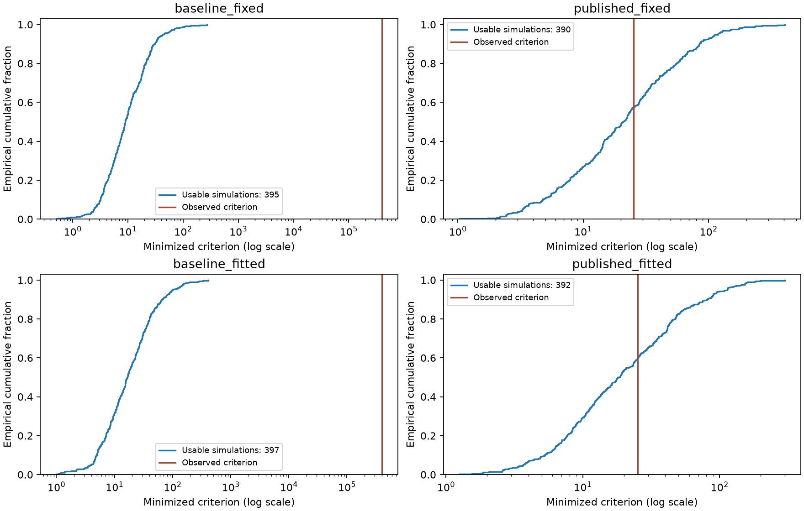

# SW07 finite-sample diagnosis — 2026-10-01

**Completed: 1,596 simulations, four scenarios with 399 draws each.** The
declared Pfeifer baseline remains an extreme empirical mismatch. The published
calibration yields a different conclusion: its observed criterion is ordinary
relative to the simulated distribution, while the nominal 5% asymptotic
chi-square rule rejects about 62–64% of samples generated by that model. The
earlier small asymptotic J p-value is not reliable evidence of rejection at this
sample size. This does not establish model adequacy or justify ordinary
parameter confidence intervals.

The [protocol](protocol.md) was selected before running the simulations. It is
a development protocol, not an externally registered analysis plan. The original
observed-data fits, bounds, covariance estimator and calibration were preserved.
No package was released.

## Completed experiment

All draws contain 156 stationary Gaussian quarters, including a random initial
state from the exact stationary covariance. Each draw reconstructs all 15
sample-centered moments on the common 152-quarter product window and its own
full Bartlett HAC covariance. Nine moments fit `crr` and `em` from all four
original optimizer starts; six moments remain reserved descriptive diagnostics.
Fits use bandwidth eight. Bandwidths four and twelve are additional covariance
audits on the same samples, without changing the fitted estimator.

The two fixed scenarios use the full declared Pfeifer and rounded published-mode
calibrations. The two fitted scenarios replace only `crr` and `em` by their
observed-data estimates, making them descriptive plug-in experiments. All four
hold the other coefficients and shock variances fixed. The master seed is
20261001; scenario and replication indices determine independent streams.

| Scenario | Usable / 399 | Unresolved | Boundary among usable | Observed criterion | Simulated median | Simulated 95th percentile |
|---|---:|---:|---:|---:|---:|---:|
| `baseline_fixed` | 395 | 4 | 91 | 396736.0958 | 8.9551 | 43.6875 |
| `published_fixed` | 390 | 9 | 7 | 25.2554 | 20.6797 | 115.0856 |
| `baseline_fitted` | 397 | 2 | 346 | 396736.0958 | 16.6125 | 99.9161 |
| `published_fitted` | 392 | 7 | 1 | 25.2554 | 18.2013 | 110.8987 |

Quantiles condition on usable fits. Every failure remains in the denominator
of the exceedance bounds below: the lower bound treats unresolved draws as
non-exceedances and the upper bound treats them as exceedances. Conservative
95% Monte Carlo intervals envelope the corresponding Clopper–Pearson intervals.

| Scenario | Observed-criterion exceedances among usable | Exceedance fraction bounds | Conservative 95% MC interval |
|---|---:|---:|---:|
| `baseline_fixed` | 0 | 0–1.003% | 0–2.547% |
| `published_fixed` | 166 | 41.604–43.860% | 36.720–48.884% |
| `baseline_fitted` | 0 | 0–0.501% | 0–1.799% |
| `published_fitted` | 157 | 39.348–41.103% | 34.524–46.107% |

These are conditional simulation fractions, not validated composite-null
p-values. In particular, the fitted cases use the observed data to select their
generating parameters. Monte Carlo intervals measure simulation uncertainty,
not structural parameter uncertainty. Zero exceedances does not imply zero
tail probability or justify reporting p < 0.001 from 399 draws.



The plot conditions on usable fits; the tables retain all unresolved outcomes.

## Why the asymptotic result changes

For the published fixed model, the nominal 5% chi-square(7) rule rejects
248 usable draws. Counting the nine unresolved draws both ways gives
**62.155–64.411%**, with a conservative 95% Monte Carlo interval of
**57.195–69.112%**. Among the 383 numerically regular draws, it rejects
241 (**62.924%**, conditional MC interval 57.871–67.776%). Boundary cases
therefore cannot account for this distortion. Numerical regularity is not
statistical validity.

| Scenario | Naive 5% chi-square rejection bounds | Regular-subset rejections / denominator |
|---|---:|---:|
| `baseline_fixed` | 33.333–34.336% | 73 / 304 |
| `published_fixed` | 62.155–64.411% | 241 / 383 |
| `baseline_fitted` | 56.391–56.892% | 10 / 51 |
| `published_fitted` | 56.391–58.145% | 224 / 391 |

The published fixed result shows severe finite-sample distortion for this
estimator, sample length and DGP. It is not a general size theorem. The
published calibration itself was estimated using overlapping historical data.
Nonrejection against this conditional reference cannot validate the model or
its calibration independently.

## What explains the discrepancies

The [source and measurement audit](mapping_audit.md) found no factor-of-100 or
factor-of-four error. The bundled Pfeifer shock block specifies risk-premium
standard deviation `eb=1.8513`, which contributes **47.1712 of 48.2591** to
GDP-growth variance (**97.75%**). The source's estimation starting value and
the published mode are different numbers; no decimal was silently corrected.
Technology persistence is high but is not the dominant source of this variance.

Exact finite-sample demeaning barely changes the baseline GDP-growth variance:
**48.2591 → 48.2391**, versus observed **0.71689**. It cannot rescue this
calibration. Under the fixed published calibration, the correction instead
lowers inflation and interest-rate variances farther below their observed
counterparts:

| Published fixed moment | Observed | Population | Exact finite-sample expectation | Mean HAC8 variance / exact sampling variance |
|---|---:|---:|---:|---:|
| GDP-growth variance | 0.716890 | 0.871872 | 0.869648 | 0.9009 |
| Inflation variance | 0.370395 | 0.290129 | 0.243446 | 0.5556 |
| Interest-rate variance | 0.698755 | 0.364379 | 0.300163 | 0.5251 |

The last column concerns the variance of each moment estimator, not the
variance of the underlying macroeconomic series. Demeaning changes the last
two expectations by approximately **0.674 and 0.697 exact sampling standard
deviations**. The observed interest-rate variance is **4.324 sampling standard
deviations** above its fixed-published expectation; this is a marginal
descriptive discrepancy, not a normal-theory p-value.

For the reserved lag-four inflation/rate autocovariances, mean HAC8 estimates
are only **0.4841 / 0.4697** of the exact sampling variances. Bandwidth twelve
raises these ratios to **0.5304 / 0.5139**, still far below one. This is not
evidence that raising the bandwidth alone repairs inference.

HAC does not universally understate joint uncertainty. For the nine fitted
moments under the published fixed model, generalized eigenvalues of mean HAC8
relative to the exact covariance range from **0.408 to 3.938**. Some linear
combinations are understated and others overstated. Demeaning bias, random
estimated weights, nonnormal quadratic moment estimators and parameter fitting
remain entangled; this experiment does not apportion the rejection distortion
causally among them.

All 1,596 moment/HAC constructions completed, including draws with unresolved
optimization. Across the 60 scenario/moment means, the largest discrepancy
between simulated and exact expectations is **2.123 Monte Carlo standard
errors**. Exact references were also checked independently with dense Gaussian
quadratic-form identities, scalar AR(1) controls and nonsymmetric multivariate
transition systems. Agreement here validates the moment calculation; the
simulation and audit still share the package's DSGE solution matrices and do
not constitute an independent SW07 solver benchmark.

## Numerical failures and reproducibility

The 22 unresolved fits remain unresolved in the saved experiment. Sixteen
selected solutions failed the optimizer's interior first-order stationarity
check, four had multistart objective disagreement, and two contained unsuccessful
optimizer starts. Here “stationarity” means the local optimization condition,
not stationarity of the generating DSGE dynamics. Every DGP passed the dynamic
stationarity checks. Boundary solutions with otherwise usable optimization
remain in the simulated criterion distributions, with regular inference withheld.

The [failure audit](failure_audit/README.md) classifies the saved per-start diagnostics
and replays representative targets without replacing original outcomes.
All four CLI processes completed and exported their artifacts; they intentionally
returned status 1 because each contains unresolved numerical outcomes. See
[execution status](execution_status.json).

A user application reset interrupted an earlier attempt before final artifacts
were saved. That attempt is not counted. The identical design was restarted
with atomic checkpoints and full per-start diagnostics. Checkpoints fingerprint
the settings, generating parameters, observed data, nine numerical source files,
and Python/NumPy/SciPy/pandas versions. A regression test verifies that resuming
an interrupted run preserves every sample and full covariance array. A changed
design requires a fresh run. No draws were replaced based on their results.

The complete runs used Python 3.14.6, NumPy 2.5.2, SciPy 1.18.1 and pandas 3.0.5.
The [combined validation record](combined_run_validation.json) verifies every
manifest artifact hash, all four final checkpoint/NPZ array matches, and the
numerical source hashes against the checkout.

## Delivered interface and validation

The public API now includes `sw07_finite_sample_moments`,
`simulate_sw07_sample`, `run_sw07_finite_sample` and `SW07FiniteSampleStudy`.
The application exports CSV tables, complete moment/covariance arrays, per-start
optimizer diagnostics, plots, strict JSON manifests and resumable checkpoints.
The [English guide](../../docs/sw07_finite_sample.md) and
[Spanish guide](../../docs/es/sw07_finite_sample.md) explain the interface and
statistical limits. The earlier empirical guide now distinguishes its historical
asymptotic result from the completed finite-sample assessment.

- **171 targeted tests passed** across new sampling/experiment/application tests,
  existing structural/empirical bridge tests, bilingual docs and Pyodide checks.
  The two warnings are existing private-module deprecations; see [test log](tests.log).
- **Two additional failure-gate tests passed**, covering false optimizer success
  and the distinction between valid boundary criteria and regular inference.
- **Four executable documentation examples passed**; see
  [documentation execution log](docs-execution-tests.log).
- **Fresh installed wheel and strict MkDocs build passed**. The isolated wheel
  smoke test blocks network and statsmodels, verifies exact moments/stationary
  simulation, and compares API/CLI arrays, exports and checkpoint resume. This
  is separate installation evidence with two draws, not another scientific
  experiment. See the [wheel validation dossier](wheel-validation/README.md).
- The new public API snapshot matches. Nine unrelated pre-existing differences
  elsewhere in the shared checkout remain explicit in the
  [snapshot audit](api-snapshot-audit.json); no whole-repository green claim is made.

## Evidence and reproduction

The combined [summary](combined_summary.csv),
[moment audit](combined_moment_audit.csv) and
[independent numerical review](independent_review.md) support this report.
Each scenario directory contains `report.md`, five CSVs, `draw_evidence.npz`,
`manifest.json`, a plot and `_checkpoints/`. Full cross-moment covariance audits
are in each scenario's `covariance_audit.csv`.

```bash
python -m puremacro.examples.sw07_finite_sample \
  --replications 399 --seed 20261001 --bandwidth 8 \
  --output research_output/sw07_finite_sample
```

All four scenarios are the default. Use a repeated `--scenario` flag to select
individual scenarios. To validate/combine this dossier without rerunning
estimation:

```bash
python reviews/2026-10-01-sw07-finite-sample/summarize_study.py
```

Remaining limits are Gaussian innovations, fixed calibrations, a constant
stationary model across the historical sample, revised FRED observations rather
than the original vintage, and finite simulation precision. Raw source-series
downloads were not available for independent reconstruction of the bundled CSV.
The appropriate next research experiment would predeclare and separately
validate finite-sample expectations and model-based weighting, then address
calibration uncertainty before restoring parameter inference. No estimator
replacement or inferential fix is claimed by this diagnosis.
