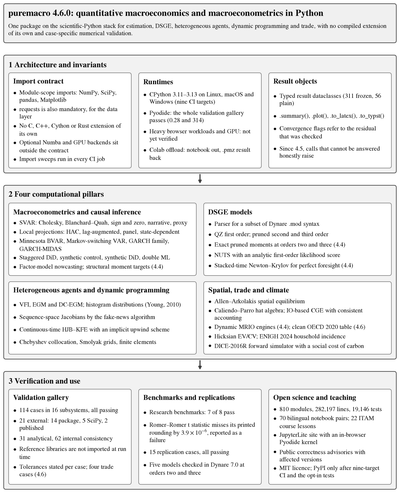
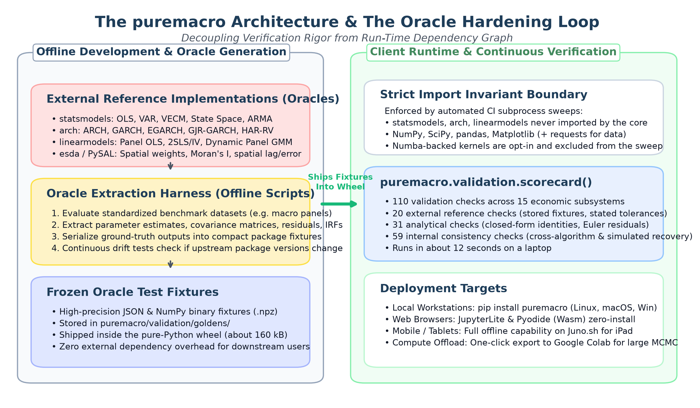
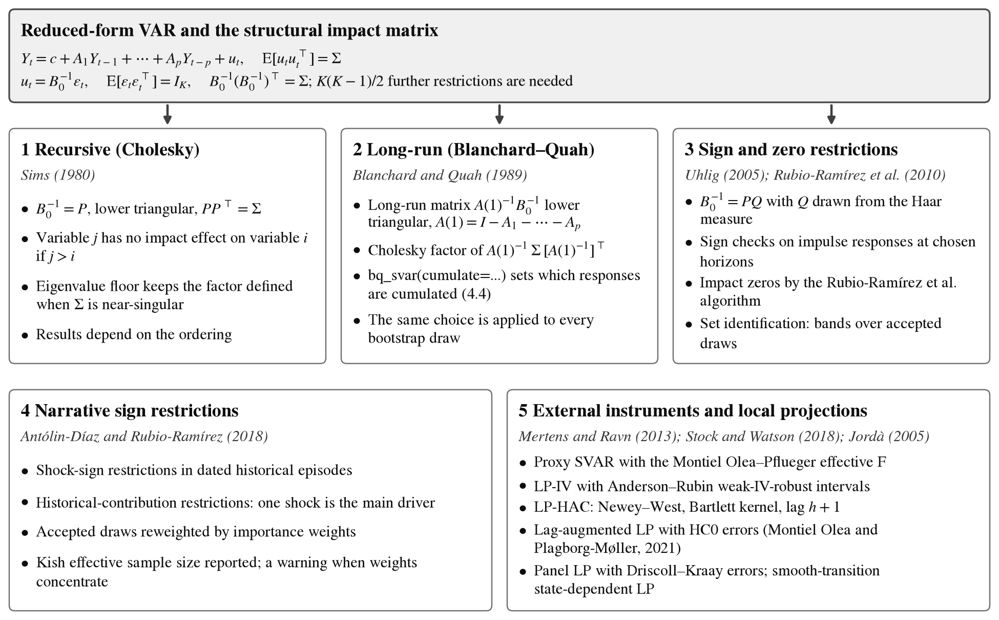
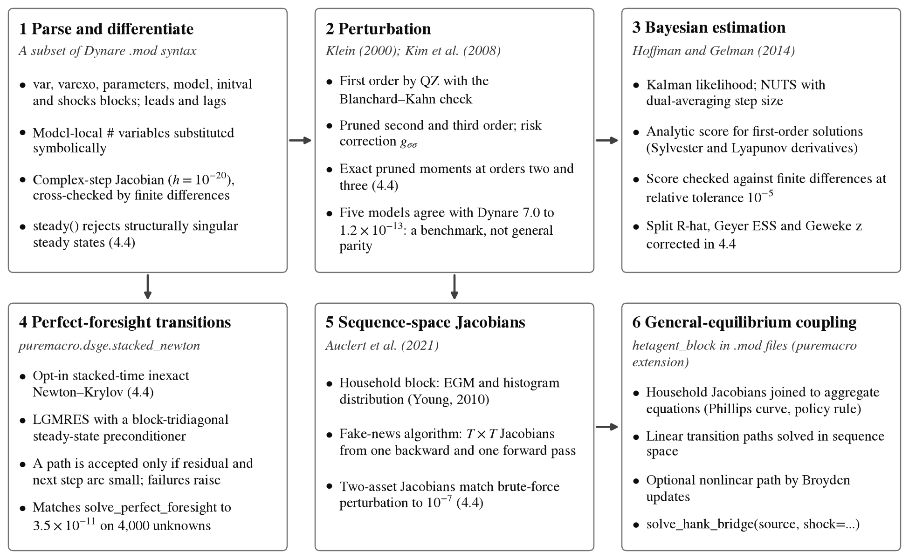
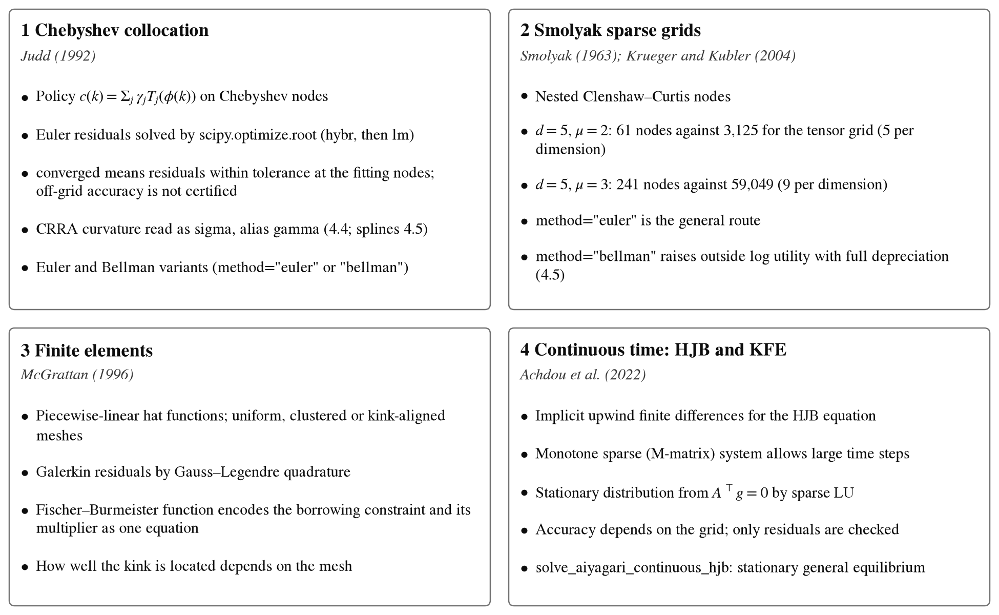
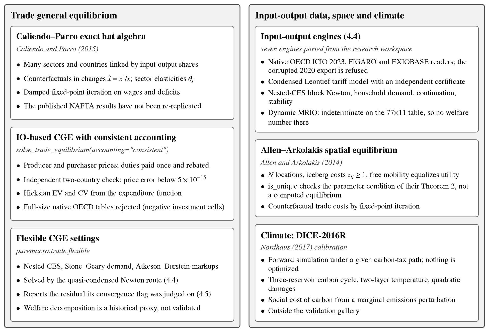
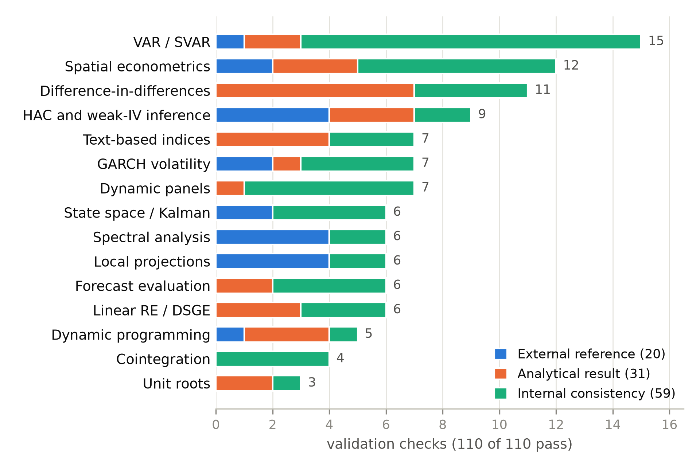

# puremacro: A Unified, Dependency-Minimal Scientific-Python Engine for Quantitative Macroeconomics and Macroeconometrics
## Architecture, Algorithmic Foundations, Numerical Validation, and Browser-Native Reproducibility

**Jorge Alonso Ortiz**1,★ · **Claude**2 · **Codex**3 · **Antigravity**4

1 Department of Economics, Instituto Tecnológico Autónomo de México (ITAM), Río Hondo No. 1, Col. Progreso Tizapán, Mexico City, 01080, Mexico. Email: [jorge.alonso@itam.mx](mailto:jorge.alonso@itam.mx) | ORCID: [0000-0002-5941-9928](https://orcid.org/0000-0002-5941-9928)\
2 AI coding agent, Anthropic (Claude Opus 5, Opus 5.5, Fable 5 and Fable 5.1)\
3 AI coding agent, OpenAI\
4 AI coding agent, Google\
★ Corresponding author. The human author directed the project, made every design and release decision, and takes sole responsibility for the content; the three AI coauthors are credited for their work but cannot be held accountable for it. See [Authorship and contributions](#authorship-and-contributions).

Technical Report & Working Paper v4.5 — honest convergence, 3 October 2026\
GitHub Repository: [https://github.com/jalonso1979/puremacro](https://github.com/jalonso1979/puremacro)\
Interactive Platform: [https://jalonso1979.github.io/puremacro/](https://jalonso1979.github.io/puremacro/)

> **Validation scope, 3 October 2026 (version 4.5.0).** Feature descriptions below are not universal accuracy or convergence guarantees. Read [Structural validation status](../docs/STRUCTURAL_VALIDATION_STATUS.md) and the [correctness advisories](../docs/ADVISORY.md) before using the newest trade, higher-order DSGE or VFI outputs. The gallery contains 59 internal, 31 analytical, 13 package, five SciPy and two published-reference cases (110, all passing), with no trade cases. Since 4.4.0 the full test suite passes with no accepted failures and continuous integration is green on all nine targets (Linux, macOS and Windows, Python 3.11–3.13); since 4.5.0 nothing reaches PyPI unless that matrix passes on the tagged commit. A September follow-up ran five models in Dynare 7.0 at orders two and three and validated native OECD 2023/2019 ingestion and calibration, with counterfactuals on a conserving small aggregation. GPU and browser workloads remain unverified; see the [independent-validation report](../reviews/2026-09-20-independent-validation/REPORT.md), including the MATLAB shutdown caveat.

---

### Abstract
Puremacro is an open-source Python library for empirical macroeconometrics and quantitative macroeconomic models. It combines estimation, DSGE perturbation, heterogeneous-agent methods, dynamic programming and quantitative trade in a shared scientific-Python environment. The package ships no compiled extension of its own; its scientific dependencies include compiled components. Its 110-case validation gallery combines internal consistency, analytical results and selected external references with case-specific tolerances. This is evidence for the tested configurations, not certification of the complete feature inventory or universal cross-platform numerical identity. Reviews in September 2026 identified structural-model defects, library functions that returned wrong numbers or wrong success flags, and unsupported claims; each confirmed defect is recorded with affected versions in a public advisory, and its fix is checked against a reference that does not come from the code under test (a published table, a closed form, Stata, R, Dynare or a brute-force computation). Version 4.4 adds an empirical-to-structural layer (`puremacro.structural`: labelled moment targets with full covariance and bounded minimum-distance estimation), an original-data Romer–Romer (2010) baseline, an observed-data Smets–Wouters (2007) moment study with finite-sample diagnostics, INEGI ENIGH 2024 distributional incidence, seven input-output trade engines including a perfect-foresight dynamic MRIO, and a stacked-time Newton–Krylov solver. An eight-case research benchmark suite passes seven cases; the eighth, the Romer–Romer horizon-ten t statistic, misses its published rounding interval by 3.9×10⁻⁶ and is reported as a failure. Version 4.5 makes calls that cannot be answered honestly raise instead of returning unverified numbers. The historical TOT/Alloc/TariffRec decomposition and automated trade theorem certification remain unavailable; general higher-order parity, other native MRIO providers/editions, full-size native GE in consistent accounting and realistic browser/GPU workloads still require further validation.

> **What changed in 4.4 and 4.5.** *Version 4.4.0 (2 October 2026)* added empirical-to-structural research workflows (`puremacro.structural`: labelled moment targets with full covariance, bounded minimum-distance estimation, joint-HAC local-projection targets, an observed-data SW07 study and an exact finite-sample SW07 diagnostic), the original-data Romer–Romer (2010) baseline, INEGI ENIGH 2024 distributional tariff incidence, seven new MRIO trade engines and a stacked-time Newton–Krylov solver. It also shipped the verified fixes of a library-wide review, resolved every accepted test failure carried since 4.2.0, and corrected `vif`, which on levels data lost digits exactly as statsmodels does (an impossible VIF of 0.053 became the exact 1.005). *Version 4.5.0 (3 October 2026)* is a trust release: the quasi-condensed trade route no longer reports `converged=True` beside a residual of 0.05, flexible trade results report the solved model's flows, `minnesota_gibbs` follows Bańbura, Giannone and Reichlin (2010) eq. (7) (its posterior Σ was 5.3% too large), the VFI solvers honour the `gamma` curvature alias, and calls that cannot be answered honestly now raise instead of returning an unverified number. Each defect has an entry in the [correctness advisories](../docs/ADVISORY.md).
---

### Graphical Abstract

*Figure 1: Comprehensive Graphical Abstract of the `puremacro` Computational Ecosystem. The diagram summarizes the architectural foundations, methodological engines, validation mechanisms, and deployment workflows. The left column outlines the strict four-package foundation (NumPy, SciPy, pandas, Matplotlib) and dual execution runtime (CPython and Pyodide WebAssembly). The center column displays the four primary computational pillars: structural macroeconometrics and causal inference, dynamic general equilibrium with exact analytical gradients, heterogeneous agents and continuous projections, and quantitative spatial and trade general equilibrium. The right column illustrates the oracle-based validation gallery, empirical replications, and interactive web and classroom deployment. Counts are those of release 4.5.0 (110 checks, 806 modules, about 281,000 lines, about 19,000 tests, 70 notebook pairs); tolerances are case-specific, and Numba and GPU backends are opt-in, outside the import contract.*

---

## 1. Introduction and the Computational Macroeconomics Trilemma

Applied macroeconomics and quantitative macroeconomic theory currently confront a profound technological challenge. While the discipline has experienced unprecedented methodological innovation over the past two decades—ranging from high-frequency identification of structural shocks and non-linear local projections to heterogeneous-agent New Keynesian (HANK) models and quantitative spatial gravity frameworks—the computational infrastructure supporting these advances remains severely fragmented. In contemporary research and graduate training, an applied economist typically must orchestrate four or five distinct software environments. Reduced-form time-series econometrics and volatility modeling frequently reside in specialized Python libraries such as `statsmodels` (Seabold and Perktold, 2010) and `arch` (Sheppard, 2025), or dedicated packages in R such as `vars` (Pfaff, 2008) and `lpirfs` (Adämmer, 2019). Meanwhile, linearized and higher-order dynamic stochastic general equilibrium (DSGE) modeling remains heavily anchored to Dynare (Adjemian et al., 2024), which operates within the proprietary MATLAB matrix laboratory or GNU Octave. Furthermore, heterogeneous-agent models and dynamic programming with continuous distributions are predominantly written in custom Fortran, C++, or Numba-accelerated Python codes (Auclert et al., 2021; Carroll et al., 2018; Batista et al., 2024), while quantitative spatial and multi-sector trade general equilibrium models often rely on bespoke Julia or GAMS implementations (Caliendo and Parro, 2015; Allen and Arkolakis, 2014).

This computational balkanization imposes substantial friction across the research lifecycle. First, combining diverse packages forces researchers to manage disparate data structures, conflicting variable naming conventions, and incompatible parameter specifications, substantially elevating the cognitive overhead required to conduct empirical investigations. Second, the reliance on commercial platforms or packages with complex compiled C-extensions creates prohibitive barriers to scientific reproducibility. Empirical replication packages frequently break when installed on different operating systems or updated compiler toolchains, rendering long-term verification precarious. Third, this technological fragmentation proves particularly devastating in educational contexts. In advanced undergraduate and graduate macroeconomic courses, valuable instructional time is routinely squandered debugging local compiler errors, managing virtual environments, and resolving operating system incompatibilities across student laptops. Students operating on low-end hardware, locked-down institutional machines, or tablets are frequently excluded from engaging directly with modern quantitative tools.

The foundational challenge confronting the discipline can be conceptualized as the *Computational Macroeconomics Trilemma*, which formalizes the historical trade-offs governing macroeconomic software design. Under this trilemma, existing computational frameworks have traditionally achieved at most two of three core scientific desiderata:

1. **Methodological Breadth**: Demanding an end-to-end computational surface encompassing structural vector autoregressions, micro-macro causal inference, nonlinear perturbation DSGE models, continuous projection algorithms, heterogeneous-agent sequence-space frameworks, and multi-sector spatial general equilibrium.
2. **Portability**: Running the same code on standard CPython workstations and, where the dependencies allow, in client-side WebAssembly browsers via Pyodide, without package-owned compiled extensions, administrative privileges, or proprietary software licenses.
3. **Numerical Verifiability**: Checking results against established econometric software, published tables and analytical solutions, with stated tolerances, without making the reference software a runtime dependency.

`puremacro` is an attempt to move along all three dimensions at once; it does not claim to have achieved each of them fully. Puremacro ships no C, C++, Cython or Rust extension of its own. Its five mandatory dependencies are NumPy, SciPy, pandas, Matplotlib and requests; additional backends (including an optional Numba backend for some VFI kernels) and file formats use optional packages.

Browser use is a design target supported by Pyodide-compatible dependencies and import checks. Running a particular workload in a browser, validating GPU numerical agreement, and obtaining bitwise-identical results are distinct tasks; realistic browser and GPU workloads remain unverified. The validation gallery covers selected configurations with explicit tolerances, and the correctness advisories ([docs/ADVISORY.md](../docs/ADVISORY.md)) record every confirmed defect, including those found after release.

---

## 2. Software Architecture and Fundamental Invariants

The architectural philosophy of `puremacro` is governed by the principle that computational software should maximize long-term scientific reproducibility, operational transparency, and universal accessibility. Pursuing these objectives in a library of 806 tracked Python modules and 281,431 lines of Python code (release 4.5.0) requires automated enforcement of structural invariants throughout the development lifecycle.

*Figure 2: Software Architecture and the Oracle Hardening Loop in `puremacro`. The schematic illustrates the decoupling between the offline verification environment and the client runtime. In the offline factory (left), established external packages (`statsmodels`, `arch`, `linearmodels`, and `esda`) compute oracle estimates on standardized macroeconomic datasets, serializing reference fixtures into compact package files. In the client environment (right), a strict import boundary forbids oracle libraries from entering the runtime. The self-contained gallery `puremacro.validation.scorecard()` illustrates the validation workflow; it does not certify all deployment targets. Counts are those of release 4.5.0; tolerances are case-specific, and the gallery's browser run time has not been measured.*

### 2.1 The Strict Four-Package Import Invariant
The import contract of `puremacro` states that shippable library modules may import only NumPy, SciPy, pandas, and Matplotlib at module scope. The install contract is one package wider: `requests` is a mandatory dependency used by the data layer. File-format engines (`pyarrow` for Parquet, `openpyxl` for Excel) are optional extras behind lazy imports. A small, documented set of modules lies outside the contract: the optional Numba kernels of the VFI and nested-DMP backends (the NumPy kernels are the Pyodide path), the MATLAB-parity teaching prototypes, the web-scraping and LLM side-channels of the narrative package, and the example scripts.

The contract is enforced by two sweeps in `tests/test_pyodide_compat.py`. The first imports every shippable module in one process and fails if `statsmodels`, `linearmodels`, `arch`, `bs4`, `pdfplumber` or `pypdf` has entered `sys.modules`. The second hands the same module list to a fresh subprocess in which those packages and the optional file-format engines are blocked, and fails if any shippable module cannot be imported without them; a further test checks that the blocker actually blocks. These tests run in the default suite on every continuous-integration target. They establish importability with the browser-absent packages missing, not that every workload runs in Pyodide.

### 2.2 Decoupled Certification: The Oracle Architecture
A central paradox in scientific software design is that establishing trust typically requires demonstrating agreement with established, peer-reviewed implementations; however, declaring those external implementations as formal runtime dependencies reduces portability and introduces dependency conflicts. `puremacro` addresses this tension through its *Oracle Architecture*, depicted in Figure 2.

During package development and release auditing, dedicated offline scripts execute external reference implementations—including `statsmodels` for vector autoregressions and state-space filters, `arch` for conditional heteroskedasticity, `linearmodels` for panel instrumental variables, and `esda` for spatial autocorrelation—across canonical benchmark datasets. The resulting point estimates, asymptotic covariance matrices, residual vectors, and impulse response trajectories are serialized into binary and JSON fixtures stored in `puremacro/validation/goldens` (156 kB in the 4.5.0 source tree), which ship inside the pure-Python wheel.

The validation gallery compares selected calculations with frozen fixtures and analytical or internal oracles. It does not import the external reference packages at runtime. Each case declares its reference mechanism and tolerance; elapsed time depends on the environment. The same principle extends beyond the gallery: the Dynare references of Section 5, the Stata `xtabond` reproduction of Section 9 and the independent-software Romer–Romer reference are produced offline and frozen, and a frozen reference produced by `puremacro` itself is labelled a regression value rather than an external check.

### 2.3 Immutable Result Containers and Publication-Ready Export
To support reproducibility and scholarly workflow integration, `puremacro` estimators and solvers generally return typed result dataclasses rather than unstructured tuples or raw arrays. Many are frozen (the package declares 311 `frozen=True` dataclasses and 56 plain ones), so immutability is a convention, not a universal guarantee.

Result objects typically carry estimated coefficients, asymptotic or bootstrapped covariance, degrees of freedom, convergence diagnostics and the model specification. Since 4.4 and 4.5, convergence flags are tied to the residual that was actually checked: where a solver cannot certify a result (for example the quasi-condensed trade route with active flexible settings, or the Smolyak Bellman method outside log utility with full depreciation) the call raises rather than returning an unverified number. Many result containers also expose a common set of presentation methods (`to_latex` is defined in 84 modules and `to_typst` in 80). Invoking `.summary()` produces a formatted textual report detailing point estimates, standard errors, $t$-statistics, $p$-values, and confidence intervals matching standard econometric publishing conventions. Calling `.plot()` automatically renders publication-grade Matplotlib figures, generating impulse response fan charts with shaded confidence intervals, forecast error variance decompositions, or phase diagrams styled according to academic typography standards. For manuscript preparation, `.to_latex()` emits complete, syntactically valid LaTeX table markup formatted with `booktabs` horizontal rules, standard error parentheticals, and statistical significance indicators. Similarly, `.to_typst()` generates native table definitions for the modern Typst typesetting engine, while `.to_markdown()` outputs GitHub-flavored markdown tables for seamless integration into interactive computational notebooks, project documentation portals, and web applications.

### 2.4 Dual Runtime Execution and Cloud Compute Offloading
Avoiding package-owned compiled extensions supports a dual runtime operational model. On standard CPython interpreters running under Linux, macOS, or Windows, `puremacro` leverages underlying OpenBLAS, MKL, or Apple Accelerate linear algebra libraries via NumPy and SciPy, Because the package's own code is pure Python and its import-time dependencies ship with Pyodide, the shippable modules are designed to import inside the Pyodide WebAssembly runtime, which hosts the JupyterLite playground (Section 10). Import checks are automated; the performance and numerical agreement of realistic workloads in the browser are not.

In resource-constrained environments, such as tablet browsers under strict memory caps, long Markov chain Monte Carlo runs or high-dimensional bootstraps can exceed device capabilities. `puremacro.runtime.colab` offers an offloading path: `generate_colab_notebook` writes a self-contained Jupyter notebook for a computation, which the user runs on Google Colab, and `load_colab_result` reads the resulting portable `.pmz` result file back into the local session. This is a convenience workflow; it has not been benchmarked on any particular model size.

---

## 3. Structural Macroeconometrics and Time-Series Analysis

Structural macroeconometrics seeks to uncover the causal effects of economic shocks on aggregate fluctuations by imposing theoretically grounded identification restrictions on reduced-form statistical models. `puremacro` provides a broad suite of vector autoregressive models and local projection estimators with common interface conventions across identification schemes.

*Figure 3: Structural Macroeconometric Identification Spectrum in `puremacro`. The diagram maps the relationship between the reduced-form vector autoregression and five structural identification methodologies. The top container specifies the reduced-form VAR system and structural covariance decomposition. The lower cards contrast recursive Cholesky triangularization (Sims, 1980), Blanchard-Quah long-run neutrality (Blanchard and Quah, 1989), Uhlig and Rubio-Ramírez sign and zero restrictions (Uhlig, 2005; Rubio-Ramírez et al., 2010), Antolín-Díaz and Rubio-Ramírez narrative restrictions (Antolín-Díaz and Rubio-Ramírez, 2018), and external proxy instruments and local projections (Mertens and Ravn, 2013; Stock and Watson, 2018; Jordà, 2005).*

### 3.1 Vector Autoregressions and Structural Identification
Consider a covariance-stationary vector autoregressive process of order $p$, denoted VAR($p$):
$$Y_t = c + \sum_{i=1}^p A_i Y_{t-i} + u_t, \quad u_t \sim \text{iid}(\mathbf{0}, \Sigma),$$
where $Y_t$ is a $K \times 1$ vector of macroeconomic variables, $c$ is a vector of deterministic intercepts, $A_i$ are $K \times K$ coefficient matrices, and $u_t$ is the reduced-form innovation vector with symmetric positive-definite covariance matrix $\Sigma$. The structural representation relates reduced-form innovations $u_t$ to mutually orthogonal, economically meaningful structural shocks $\varepsilon_t$:
$$u_t = B_0^{-1} \varepsilon_t, \quad \mathbb{E}[\varepsilon_t \varepsilon_t'] = I_K, \quad B_0^{-1} (B_0^{-1})' = \Sigma,$$
where $B_0^{-1}$ represents the structural impact matrix. Because $\Sigma$ contains $K(K+1)/2$ unique entries, while $B_0^{-1}$ contains $K^2$ parameters, the system is fundamentally under-identified, requiring $K(K-1)/2$ additional restrictions.

The library unifies the structural identification spectrum into a modular, consistent computational surface, illustrated in Figure 3. The most classical approach, recursive identification following Sims (1980), imposes a causal ordering such that variable $j$ cannot affect variable $i$ contemporaneously if $j > i$. The impact matrix is obtained via the unique lower-triangular Cholesky factor $P$ satisfying $P P' = \Sigma$. The implementation in `puremacro` uses a regularized Cholesky factorization with an eigenvalue floor, which keeps the factorization defined when an estimated covariance matrix is near-singular (at the cost of a small perturbation that the user should be aware of in that case).

For long-run neutrality restrictions, `puremacro` implements the framework of Blanchard and Quah (1989), wherein structural restrictions are imposed on the cumulative long-run multiplier matrix $C(1) = \left(I_K - \sum_{i=1}^p A_i\right)^{-1} B_0^{-1}$. Constraining $C(1)$ to be lower-triangular allows researchers to separate permanent supply disturbances from transitory demand shocks. The library evaluates $C(1)$ by direct matrix inversion and factorizes $C(1) \Sigma C(1)'$ by Cholesky decomposition. Which responses are cumulated is an explicit choice (`bq_svar(cumulate=...)`, added in 4.4): the canonical Blanchard–Quah system, with output growth and the unemployment rate in levels, requires cumulating only the first variable, whereas the default cumulates every row, under which the unemployment response converges to a nonzero constant instead of returning to zero. The same choice is applied to every bootstrap draw, so the bands are quantiles of the reported object.

Moving beyond exact zero restrictions, the library provides extensive support for agnostic sign and zero restrictions (Uhlig, 2005; Rubio-Ramírez et al., 2010). Here, the identification space is parameterized by orthogonal rotation matrices $Q \in \mathcal{O}(K)$ such that $B_0^{-1} = P Q$, where $Q Q' = I_K$. Candidate rotation matrices are drawn uniformly over the Haar measure on the orthogonal group using QR decomposition of Gaussian random matrices. Sign restrictions on impulse response trajectories $\text{IRF}_h = \Phi_h P Q$ are audited across user-specified horizons. When exact contemporaneous zero restrictions are additionally imposed, `puremacro` implements the Rubio-Ramírez et al. (2010) algorithm, utilizing sequential Householder sub-space projections to restrict candidate columns of $Q$ to the null space of the zero constraints prior to drawing sign-consistent rotations.

To overcome the excessive breadth of sign-identified set estimates, `puremacro` incorporates the narrative sign restrictions methodology developed by Antolín-Díaz and Rubio-Ramírez (2018). This approach conditions posterior draws on historical narrative evidence, admitting two fundamental restriction types: narrative shock sign restrictions, which enforce that a structural shock was positive or negative during specific historical episodes, and narrative historical contribution restrictions, which require that a designated shock was the dominant contributor to an observed historical fluctuation. Posterior inference is executed via importance sampling that systematically reweights the uniform Haar prior conditional on narrative likelihood indicators. Finally, for settings where external proxy variables are available, the library provides proxy SVAR estimation (Mertens and Ravn, 2013; Stock and Watson, 2018), reporting the Montiel Olea and Pflueger (2013) effective $F$-statistic and Anderson and Rubin (1949) weak-instrument robust confidence sets.

For Bayesian VARs, `minnesota_posterior` solves the Minnesota prior equation by equation, and `minnesota_gibbs` uses the conjugate Normal–inverse-Wishart dummy-observation form of Bańbura, Giannone and Reichlin (2010). Two defects in the conjugate path were corrected recently. Through 4.3.0 the dummy-observation block mis-centred the own first lag for a cross-variable tightness $\lambda_2 \neq 1$ (in the tight-prior limit it returned $A_1 = \mathrm{diag}(0.5, 0.5, 1)$ instead of $I$); since 4.4.0 the block follows their eq. (5) with $\lambda_2$ fixed at 1, the only value the conjugate prior can encode. Through 4.4.0 the posterior of $\Sigma$ used $T_d + T - k$ degrees of freedom instead of the $T_d + 2 + T - k$ of their eq. (7), which made its posterior mean 5.3% too large on a three-variable VAR(1) with 39 observations; 4.5.0 follows eq. (7). The Markov-switching VAR (`ms_var_fit`) is an MSIH($K$)-VAR($p$) with a shared autoregressive matrix, estimated by an expectation–conditional-maximization algorithm whose log-likelihood is monotone since 4.4; it is not Hamilton's (1989) switching-mean model.

### 3.2 Local Projections and Inference Robustness
As an alternative to vector autoregressions, Jordà (2005) introduced the method of local projections, which estimates impulse responses by fitting separate single-equation regressions for each forecast horizon $h \in \{0, 1, \dots, H\}$:
$$y_{t+h} = \alpha_h + \beta_h x_t + \sum_{l=1}^p \gamma_{h, l}' w_{t-l} + \xi_{t+h},$$
where $y_{t+h}$ is the response variable at horizon $h$, $x_t$ is the structural policy shock or treatment variable, and $w_{t-l}$ represents a vector of lagged control variables. The sequence of ordinary least squares estimates $\{\hat{\beta}_h\}_{h=0}^H$ traces the impulse response function directly without imposing the dynamic lag recursion inherent in VAR models.

Local projections exhibit substantial robustness against model misspecification in the underlying autoregressive lag structure; however, because the forecast errors $\xi_{t+h}$ inherently follow a moving average process of order $h$, the error terms are serially correlated. `puremacro` equips its local projection suite with rigorous covariance estimators. Single-country local projections (LP-HAC) employ heteroskedasticity and autocorrelation consistent standard errors following Newey and West (1987) with Bartlett kernel weights and a fixed truncation lag of $h+1$ at horizon $h$ (weights $1 - \ell/(h+2)$); there is no data-driven bandwidth selection. The lag $h+1$ is a rule-of-thumb convention, not a published recommendation: the $h$-step residual is serially correlated up to order $h$, so the kernel must reach at least that far. For inference that needs no HAC correction, the library incorporates the lag-augmented local projections (LA-LP) of Montiel Olea and Plagborg-Møller (2021), who show that controlling for one extra lag of every series makes Eicker-Huber-White standard errors with normal critical values asymptotically valid uniformly over stationary and non-stationary data and over a wide range of horizons. Since 4.4.0, `la_lp` adds exactly one extra lag at every horizon, as in their paper; through 4.3.0 it added as many lags as the largest requested horizon, so an estimate depended on which other horizons were requested. In their Table 1 design (AR(1), $\rho = 0.95$, $T = 240$, 90% nominal) the implementation's coverage over 20,000 replications is .884/.832/.802/.810/.833 against the published .878/.838/.806/.814/.833. Its standard errors are HC0, and the percentile-$t$ VAR bootstrap of that paper is not implemented. For fixed-$b$ HAC inference, critical values follow the Bartlett table of Kiefer and Vogelsang (2005); the table used through 4.3.0 matched no published source and over-rejected (a nominal 5% test rejected 7.0% of the time at $b = 0.2$). The related result of Plagborg-Møller and Wolf (2021) is that, with unrestricted lag structures, local projections and VARs estimate the same impulse responses in population, so the two estimators differ only in their finite-sample properties. Furthermore, for longitudinal datasets, panel local projections incorporate Driscoll and Kraay (1998) standard errors to account for cross-sectional spatial correlation and temporal persistence, while regime-switching local projections utilize logistic smooth transition functions to capture state-dependent shock transmission across business cycle phases.

### 3.3 High-Frequency Identification and Volatility Modeling
In financial macroeconomics, identifying monetary policy and macroeconomic news shocks requires isolating unexpected surprises occurring within tight intraday trading windows around central bank policy announcements. `puremacro` incorporates dedicated modules for processing high-frequency monetary surprise series, including the Gertler-Karadi and Nakamura-Steinsson surprise series, as well as unified volatility models. Units and signs are explicit: `gk2015_surprise` returns the implied-rate surprise, positive for a tightening (Gertler and Karadi, 2015, eq. 19), and fed-funds futures quoted as prices require `quote="price"` (before 4.4 such input produced a sign-reversed surprise). The Gertler–Karadi footnote-11 monthly averaging is available as `aggregate_to_period(method="gk2015")`; the default remains a plain sum.

The volatility engine provides pure-Python implementations of generalized autoregressive conditional heteroskedasticity (GARCH):
$$r_t = \mu + \varepsilon_t, \quad \varepsilon_t = \sigma_t z_t, \quad z_t \sim \text{iid}(0, 1),$$
$$\sigma_t^2 = \omega + \alpha \varepsilon_{t-1}^2 + \beta \sigma_{t-1}^2,$$
alongside asymmetric extensions including EGARCH and GJR-GARCH to capture leverage effects. For empirical settings linking high-frequency financial volatility with low-frequency macroeconomic fundamentals, the library implements GARCH-MIDAS (Engle et al., 2013), which decomposes conditional variance into a short-run GARCH component and a long-run fundamental trend driven by macroeconomic indicators via beta-distributed polynomial lag filters.

---

## 4. Micro-Macro Causal Inference and Nowcasting

Modern empirical macroeconomics increasingly bridges aggregate time series with granular microeconomic panel data, leveraging quasi-experimental causal inference methods to evaluate policy reforms, tax changes, and subnational shocks. `puremacro` includes the main quasi-experimental estimators alongside dynamic factor models for real-time macroeconomic nowcasting.

### 4.1 Modern Staggered Difference-in-Differences
Recent econometric literature has demonstrated that traditional two-way fixed effects regressions fail in the presence of staggered treatment adoption and heterogeneous treatment effects, often yielding severely biased or negatively weighted policy estimates. To address this, `puremacro` implements the robust estimators of Callaway and Sant'Anna (2021) and Sun and Abraham (2021).

The Callaway and Sant'Anna (2021) estimator identifies group-time average treatment effects $ATT(g, t)$ for cohorts first treated at time $g$:
$$ATT(g, t) = \mathbb{E}\left[ Y_t - Y_{g-1} \mid G_g = 1 \right] - \mathbb{E}\left[ Y_t - Y_{g-1} \mid C = 1 \right],$$
where $G_g = 1$ denotes units treated in period $g$, and $C = 1$ denotes a clean comparison group composed either of never-treated units or not-yet-treated units. `puremacro` implements both outcome regression and doubly robust inverse-probability weighting schemes, with aggregation of $ATT(g, t)$ into event-study trajectories and overall summaries. Since 4.4.0 the aggregation follows the paper: the event study weights cohorts by size (Callaway and Sant'Anna, 2021, eq. 3.4) and the overall effect is their $\theta^O_{sel}$ (eq. 3.11), with the bootstrap re-estimating cohort sizes on every draw. Through 4.3.0 cohorts were averaged equally and the overall effect was the plain mean of post-treatment cells, which is none of the paper's estimands; `aggregation="unweighted"` reproduces the old numbers. Two analytical gallery cases on a staggered, unequal-cohort panel check the Callaway–Sant'Anna and Sun–Abraham aggregations against the papers' equations. The Sun–Abraham event-study standard error is now a joint bootstrap over units (it previously treated cohort estimates that share control units as independent and understated the sampling s.d. by 15–26% in Monte Carlo runs). Bands are pointwise; no simultaneous sup-$t$ band is provided.

### 4.2 Synthetic Control and Synthetic Difference-in-Differences
When evaluating policy interventions implemented in a single jurisdiction or aggregate unit, `puremacro` provides comparative case study methods that overcome the limitations of ad-hoc control selection. The synthetic control method of Abadie et al. (2010) constructs an optimal convex combination of untreated donor units that minimizes the pre-treatment divergence between the treated unit and the donor pool. The donor weights $W^* = (w_2, \dots, w_{J+1})'$ are obtained by solving a constrained quadratic programming problem under non-negativity and sum-to-one restrictions. Statistical inference is conducted via systematic in-space and in-time placebo permutation tests, generating empirical $p$-values based on post-to-pre treatment mean squared prediction error ratios.

To enhance robustness in settings with substantial level differences between units, the library implements synthetic difference-in-differences (SDID) following Arkhangelsky et al. (2021). SDID generalizes the synthetic control framework by simultaneously estimating unit weights that balance pre-treatment trends and time weights that balance unexposed periods, while incorporating additive unit and time fixed effects. Arkhangelsky et al. (2021) show that this double weighting can reduce bias from additive confounders relative to synthetic control and difference-in-differences. Since 4.4.0 inference follows their Section 5: the placebo variance (their Algorithm 4) for one or two treated units and the unit bootstrap (Algorithm 2) from three, with Gaussian intervals. The earlier donor-only bootstrap covered the truth only 50–67% of the time at a nominal 90% with one treated unit. The weight problem is now solved in scale-free units and certified by its KKT conditions: before 4.4.0, a weight solve that SLSQP flagged as failed fell back to uniform weights, which silently turned SDID into plain difference-in-differences for outcomes in large units. On the California Proposition 99 panel the estimator now returns $\hat\tau = -15.61$, matching their Table 1 (4.3.0 returned the DiD value, $-27.35$).

### 4.3 Double / Debiased Machine Learning
To estimate structural parameters in the presence of high-dimensional control variables without suffering from regularization bias, `puremacro.causal` implements Double/Debiased Machine Learning for the partially linear regression model (Chernozhukov et al., 2018):
$$Y = D \theta_0 + g_0(X) + U, \quad \mathbb{E}[U \mid D, X] = 0,$$
$$D = m_0(X) + V, \quad \mathbb{E}[V \mid X] = 0,$$
where $D$ is the policy variable of interest, $X$ is a high-dimensional vector of controls, and $\theta_0$ is the structural parameter. The algorithm employs $K$-fold cross-fitting and constructs Neyman-orthogonal score functions $\psi(W; \theta, \eta) = (Y - \hat{g}(X) - \theta (D - \hat{m}(X))) (D - \hat{m}(X))$ using native regularized linear estimators, delivering $\sqrt{N}$-consistent and asymptotically normal inference for $\theta_0$.

### 4.4 Mixed-Frequency Nowcasting and Dynamic Factor Models
Central banks and financial institutions must monitor economic activity in real time, where indicators are sampled at disparate frequencies (monthly industrial production vs. quarterly GDP) and subject to publication lags that create an unbalanced ragged edge of data.

`puremacro.nowcast` implements the dynamic factor model of Giannone et al. (2008) and Bańbura and Modugno (2014). The observable vector $y_t$ is modeled as driven by a small number of latent common factors $f_t$:
$$y_t = \Lambda f_t + e_t, \quad e_t \sim \mathcal{N}(0, R),$$
$$f_t = A_1 f_{t-1} + \dots + A_p f_{t-p} + u_t, \quad u_t \sim \mathcal{N}(0, Q).$$
To handle arbitrary patterns of missing data and ragged edges without discarding observations, the model is cast into state-space form and estimated using an expectation-maximization algorithm coupled with a vectorized Kalman smoother. Following Bańbura and Modugno (2014), the EM update steps evaluate conditional expectations of missing data points directly, enabling a news decomposition that attributes revisions in GDP forecasts to specific data releases. In real-time replays (`realtime_nowcast(as_of=...)`), the baseline of the news decomposition is, since 4.4.0, the last vintage strictly before the `as_of` vintage, so that the information sets are nested; through 4.3.0 the default baseline could be a vintage published after `as_of`.

### 4.5 Dynamic Panels and Shift-Share Designs
The dynamic-panel estimators `ab_gmm` and `bb_gmm` implement difference and system GMM (Arellano and Bond, 1991; Blundell and Bond, 1998) with the Windmeijer (2005) finite-sample correction of two-step standard errors, which since 4.4.0 is evaluated at the one-step estimate as in that paper and Stata. With uncollapsed instruments, `ab_gmm` reproduces Stata's `xtabond` Examples 1, 2 and 4 on the Arellano–Bond data to every printed digit; those data are not bundled, so the test runs only where they are supplied. `bb_gmm` has not been verified against Stata's `xtdpdsys`. For shift-share instruments, `shift_share_iv` reports the standard error of Adão, Kolesár and Morales (2019), which since 4.4.0 matches the authors' `ShiftShareSE` R package on its vignette data (unclustered s.e. 0.2101180; 4.3.0 gave 0.1816483). Their weak-instrument-robust AKM0 interval is not implemented.

---

## 5. Dynamic Stochastic General Equilibrium (DSGE) Modeling

Dynamic stochastic general equilibrium models constitute the core workhorse of modern quantitative macroeconomics and monetary policy analysis. Historically, solving and estimating DSGE models has required MATLAB/Octave workflows, including the open-source Dynare package. `puremacro` provides a native Python DSGE engine that parses a subset of Dynare `.mod` syntax, computes pruned perturbation solutions up to third order, and performs Bayesian estimation, including Hamiltonian Monte Carlo with analytic likelihood gradients. Agreement with Dynare is established case by case (Section 5.2), not in general.

*Figure 4: Integrated DSGE Perturbation, Bayesian NUTS Estimation, and Sequence-Space Jacobian Workflow. The architecture encompasses four integrated stages: (1) native parsing of Dynare `.mod` syntax and complex-step Jacobian differentiation; (2) first-order Klein QZ solutions and second-order perturbation with Kim et al. pruning and risk corrections ($g_{\sigma\sigma}$); (3) Bayesian estimation via the No-U-Turn Sampler (NUTS) utilizing exact analytical Kalman likelihood score gradients ($\nabla_\theta \ln L$); and (4) coupling microeconomic heterogeneous-agent household blocks with aggregate DSGE market-clearing conditions via the Auclert et al. sequence-space Jacobian method.*

### 5.1 Native Dynare Parser and Complex-Step Differentiation
`puremacro.dsge` features a native lexer and recursive-descent parser capable of reading Dynare `.mod` files directly. The parser interprets standard declaration blocks, including `var`, `varexo`, `parameters`, `model`, `initval`, and `shocks`, resolving dynamic lead-lag relationships (such as $c_{t+1}$ represented as `c(+1)` and $k_{t-1}$ as `k(-1)`). Model-local `#` variables are substituted symbolically, as in Dynare; through 4.3.0 a local that depended only on parameters was frozen at the file's calibration, so every re-solve at other parameter values (estimation, identification, optimal simple rules) kept the load-time value, and in `sw07_pfeifer.mod` the likelihood was exactly flat in `constebeta`. `steady()` checks the structural (Dulmage–Mendelsohn) matching of the steady-state system and, since 4.4.0, raises for a structurally singular steady state instead of returning an arbitrary point of a continuum; the check is structural, so collinear equations with complete incidence are not detected.

A major bottleneck in non-symbolic DSGE solvers is the accumulation of numerical truncation errors during numerical differentiation of non-linear equilibrium equations $f(y_{t+1}, y_t, y_{t-1}, u_t; \theta) = 0$. While standard finite differencing suffers from $O(\epsilon)$ cancellation errors, `puremacro` utilizes the complex-step derivative approximation:
$$\frac{\partial f_i(x)}{\partial x_j} = \frac{\text{Im}\left[ f_i(x + i h e_j) \right]}{h} + O(h^2),$$
where $h = 10^{-20}$ and $e_j$ is the $j$-th unit basis vector. Because the complex-step formulation involves no subtraction in the numerator, it does not suffer catastrophic cancellation and gives first derivatives accurate to rounding for residual functions that are complex-analytic; `build` cross-checks one complex-step Jacobian against finite differences to catch non-analytic code. Parsed models use symbolic derivatives for the higher-order tensors; the callable-model fallback has finite-difference accuracy.

### 5.2 First- and Second-Order Perturbation with Dynare Parity
Given the equilibrium system $\mathbb{E}_t [ f(y_{t+1}, y_t, y_{t-1}, u_t) ] = 0$, the first-order approximation around the deterministic steady state $(\bar{y}, \mathbf{0})$ yields a linear rational expectations system:
$$A \mathbb{E}_t \hat{y}_{t+1} + B \hat{y}_t + C \hat{y}_{t-1} + D u_t = 0.$$
`puremacro` solves this system using the generalized Schur (QZ) decomposition method of Klein (2000), automatically checking the Blanchard and Kahn (1980) rank and order conditions to classify the model as uniquely determinate, indeterminate, or explosive. The policy decision rules take the form:
$$\hat{y}_t = g_x \hat{s}_{t-1} + g_u u_t,$$
using Dynare-style `ghx` and `ghu` decision-rule conventions; parity must be checked against an independent reference.

For welfare analysis, term premia, and precautionary behavior, linear approximations are insufficient. `puremacro` implements second-order perturbation approximations:
$$\hat{y}_t = g_x \hat{s}_{t-1} + g_u u_t + \frac{1}{2} G_{xx} (\hat{s}_{t-1} \otimes \hat{s}_{t-1}) + \frac{1}{2} G_{uu} (u_t \otimes u_t) + G_{xu} (\hat{s}_{t-1} \otimes u_t) + \frac{1}{2} g_{\sigma\sigma} \sigma^2,$$
where $g_{\sigma\sigma}$ represents the endogenous risk correction shifting the stochastic steady state away from the deterministic baseline. To prevent the explosive paths that unpruned higher-order simulations can produce, `puremacro` implements the pruning scheme of Kim et al. (2008), decomposing state trajectories into first-, second- (and third-) order components; Andreasen, Fernández-Villaverde and Rubio-Ramírez (2018) show that the pruned system is stable whenever the first-order solution is. Since 4.4.0, exact unconditional moments of the pruned solution at orders two and three (mean, covariance, correlations and autocorrelations) are computed from their closed forms for that pruned state space, for up to about 13 states. The ergodic mean of the pruned solution and the risky (zero-shock fixed-point) steady state are distinct objects with separate methods; through 4.3.0 the method named `stochastic_steady_state()` returned the ergodic mean.

Evidence for Dynare parity is bounded and explicit. Five models (including correlated shocks, nonlinear states and an RBC model) were run in live Dynare 7.0 at orders two and three: steady states, all unfolded decision-rule tensors and risk corrections agree to a maximum tensor error of $1.15\times10^{-13}$ and simulated paths to $2.7\times10^{-13}$. The exact pruned moments reproduce Dynare 8's pruned means and covariances to $2\times10^{-13}$ at order three and its means, covariances and autocorrelations to $7\times10^{-14}$ at order two. At order three Dynare's own autocorrelations omit a correlation term; a closed form and Dynare's own long simulations agree with `puremacro` there (0.475 against Dynare's 0.330 at lag one for one test variable). Third-order theoretical moments before 4.4.0 returned first-order covariances, and third-order risk slopes before 4.3.0 were wrong; both have advisories. This is a benchmark on selected models, not general parity.

### 5.3 Bayesian Estimation via NUTS and Exact Analytical Score Gradients
Estimating DSGE models via Bayesian methods requires evaluating the Gaussian log-likelihood $\ln L(\theta \mid Y_{1:T})$ via the Kalman filter:
$$\ln L(\theta \mid Y_{1:T}) = -\frac{T K}{2} \ln(2\pi) - \frac{1}{2} \sum_{t=1}^T \left( \ln |F_t| + v_t' F_t^{-1} v_t \right),$$
where $v_t = Y_t - Z \hat{s}_{t \mid t-1}$ represents the one-step-ahead forecast error and $F_t = Z P_{t \mid t-1} Z' + H$ is its covariance matrix. In existing packages, sampling from the posterior distribution $p(\theta \mid Y_{1:T}) \propto L(\theta \mid Y_{1:T}) p(\theta)$ relies heavily on the Random Walk Metropolis-Hastings algorithm, which suffers from slow exploration and poor scalability in high-dimensional parameter spaces.

As an alternative, `puremacro` implements the No-U-Turn Sampler, an adaptive Hamiltonian Monte Carlo algorithm (Hoffman and Gelman, 2014), which requires the gradient of the log-posterior $\nabla_\theta \ln p(\theta \mid Y_{1:T}) = \nabla_\theta \ln L(\theta) + \nabla_\theta \ln p(\theta)$. Instead of finite differences of the Kalman likelihood, `puremacro` computes the score $\nabla_\theta \ln L$ analytically for first-order solutions.

The derivative of the decision rule $G$ with respect to each parameter solves a generalized Sylvester equation obtained by differentiating the first-order equilibrium conditions, which is solved by one complex Schur decomposition of $G$ and column-wise back-substitution shared across parameters. The derivative of the initial covariance $P_0 = T P_0 T' + R Q R'$ solves the differentiated discrete Lyapunov equation. The score then accumulates through a forward recursion of the time-varying Kalman filter:
$$\frac{\partial \ln L}{\partial \theta_j} = -\frac{1}{2} \sum_{t=1}^T \left[ \text{tr}\left( F_t^{-1} \frac{\partial F_t}{\partial \theta_j} \right) + 2 v_t' F_t^{-1} \frac{\partial v_t}{\partial \theta_j} - v_t' F_t^{-1} \frac{\partial F_t}{\partial \theta_j} F_t^{-1} v_t \right],$$
with state and covariance sensitivities propagated alongside the filter. The structural parameter derivatives come from differentiating the parsed model. The test suite checks the decision-rule derivatives against complex-step references and the score against finite differences at a relative tolerance of $10^{-5}$; these are analytic derivatives verified to that tolerance, not a machine-precision certificate. The NUTS implementation is tested on Gaussian and banana-shaped targets and on an end-to-end DSGE estimation; its sampling efficiency relative to random-walk Metropolis–Hastings on medium-scale models has not been benchmarked in this report. Chain diagnostics were corrected in 4.4.0: `geweke_z` uses an AR spectral estimate at frequency zero (agreeing with R's `coda` to about $10^{-11}$), `effective_sample_size` follows Geyer's initial monotone sequence and agrees with arviz on a single chain, and a split $\hat R$ is reported.

### 5.4 Perfect-Foresight Transitions and Stacked-Time Newton–Krylov
For deterministic transitions, `solve_perfect_foresight` solves the stacked system of equilibrium conditions over a finite horizon. Version 4.4.0 adds `puremacro.dsge.stacked_newton`, an opt-in, model-agnostic inexact Newton–Krylov solver for the same stacked system: Jacobian–vector products are analytic, central-difference or complex-step; linear systems are solved by preconditioned LGMRES with an exact block-tridiagonal (block-Thomas, with SuperLU fallback) inverse of the steady-state stacked Jacobian as preconditioner; steps are bounded in path units and accepted by an Armijo line search. A path is accepted only when the stacked residual meets the tolerance and the next Newton step is negligible; failures raise with the last state attached. On a 4,000-unknown 20-sector growth transition it matches `solve_perfect_foresight` to $3.5\times10^{-11}$, and it reproduces the input-output research engine from which it was ported to $10^{-13}$ on that engine's analytic fixture. Evidence covers analytic DSGE-size fixtures only; memory is $O(T n^2)$, and no native-scale MRIO transition is solved with it.

### 5.5 Smets–Wouters (2007), Identification and Optimal Policy
The bundled Smets and Wouters (2007) model and data were corrected in 4.4.0. Through 4.3.0 the price and wage markup processes lacked their MA terms and the innovations entered one quarter late, so `cmap` and `cmaw` did not enter the likelihood; the bundled hours series lacked a factor of 100, and consumption and investment did not follow the paper's data appendix. The responses to all seven shocks now equal those of the Pfeifer `.mod` solved by `puremacro` to $10^{-12}$, and an optimized posterior mode matches the Mode column of the paper's Tables 1a–1b within 6.2% for 13 parameters. The bundled series are current FRED vintages, not the authors' data, and the paper's marginal likelihood (which uses a 1956–65 training-sample prior) is not reproduced; the log-posterior, Laplace and harmonic-mean values in the replication gallery are labelled `puremacro` regression values. `identification()` evaluates every Jacobian at the requested point since 4.4.0 (it previously mixed the calibration and the requested point), and the optimal-policy solvers report NaN with a warning instead of placeholder values when an internal solve fails. Section 9.3 describes a separate observed-data moment study of the same model.

---

## 6. Heterogeneous-Agent Macroeconomics and Sequence Space

The frontiers of macroeconomic research increasingly emphasize models with rich household and firm heterogeneity, incomplete insurance markets, and idiosyncratic income risk. `puremacro` bridges microeconomic heterogeneous-agent blocks with aggregate general equilibrium using two advanced paradigms: the Sequence-Space Jacobian method and continuous-time partial differential equations.

### 6.1 Microeconomic Household Optimization and Ergodic Distributions
The microeconomic foundation of heterogeneous-agent models consists of households optimizing consumption and wealth accumulation subject to idiosyncratic labor productivity risk and uninsurable borrowing constraints (Huggett, 1993; Aiyagari, 1994). The household problem satisfies the Bellman equation:
$$v(a, s) = \max_{c, a'} \left\{ u(c) + \beta \sum_{s'} \pi(s' \mid s) v(a', s') \right\},$$
subject to:
$$c + a' = (1 + r) a + w s + T, \quad a' \ge \underline{a},$$
where $a$ is asset holdings, $s$ is Markovian labor productivity, $r$ is the real interest rate, $w$ is the real wage, and $\underline{a}$ denotes the borrowing limit.

The computational module `puremacro.vfi` provides an integrated suite of policy function solvers designed to eliminate optimization bottlenecks. For standard concave consumption problems, the library implements the Endogenous Grid Method (Carroll, 2006), which inverts the first-order Euler equation to map future asset choices directly to current policy values without numerical rootfinding. When households confront discrete decisions—such as occupational choice, retirement timing, or default—the module deploys Discrete-Continuous EGM (Iskhakov et al., 2017), incorporating an analytical upper-envelope filter that prunes suboptimal policy branches arising from non-concave value functions. To track the evolution of cross-sectional distributions over time, `puremacro` implements the non-stochastic forward density iteration framework of Young (2010), updating asset-productivity distributions over fine piecewise-linear grids to compute invariant ergodic measures without Monte Carlo simulation variance.

The general-equilibrium wrapper `solve_aiyagari_continuous` was hardened in 4.4.0. Its household EGM previously stopped at a hidden 500-iteration cap and `converged` was reported as true unconditionally; on the documented three-state example the true excess demand at the reported rate was $1.6\times10^{-2}$ against a reported $-2.5\times10^{-6}$. `converged` now requires EGM convergence, a converged stationary distribution and market clearing within a stated tolerance, and failures are named in a warning. Showcase notebook 67 re-solves Huggett (1993, Tables 1–2) and Aiyagari (1994, Tables I–II): Aiyagari's Table I discretization is reproduced exactly and every published ordering holds, but the published decimals are not (Aiyagari's rates differ by up to 0.26 percentage points, against a numerical error of about 0.005 points under grid refinement).

### 6.2 The Sequence-Space Jacobian (SSJ) Bridge
To analyze aggregate shocks and general equilibrium dynamics in heterogeneous-agent New Keynesian models, `puremacro` incorporates the Sequence-Space Jacobian framework of Auclert et al. (2021).

Rather than relying on state-space master equations that suffer from severe dimensionality curses, the SSJ method linearizes the heterogeneous-agent economy around its stationary equilibrium directly in the space of infinite sequences. Let $\mathbf{Z} = \{Z_t\}_{t=0}^\infty$ represent aggregate input price paths (such as interest rates, wages, and transfers) and $\mathbf{X} = \{X_t\}_{t=0}^\infty$ represent aggregate output decisions (such as consumption and labor supply). The linearized household response satisfies:
$$d\mathbf{X} = \mathcal{J}_{\mathbf{X}, \mathbf{Z}} \, d\mathbf{Z},$$
where $\mathcal{J}_{\mathbf{X}, \mathbf{Z}} = \left[ \frac{\partial X_t}{\partial Z_s} \right]_{t, s \ge 0}$ is the sequence-space Jacobian matrix. `puremacro` implements the fake-news algorithm (Auclert et al., 2021), which builds these $T \times T$ Jacobians from one backward and one forward pass by decomposing impulse responses into prediction vectors and distribution transition operators.

`puremacro` also exposes this machinery from Dynare-style syntax through a `hetagent_block;` declaration in `.mod` files (a `puremacro` extension, not Dynare syntax). The parser extracts the household block, solves the stationary steady state, computes the sequence-space Jacobians, and couples them with aggregate equations such as Phillips curves and policy rules; linearized general-equilibrium transition paths after unexpected aggregate shocks are then solved in sequence space. The one-asset solver is the reference case. The two-asset solver (`solve_two_asset_hank_sequence_space`) was substantially corrected in 4.4.0: its household iteration previously ran 50 fixed steps into a 2-cycle while reporting convergence, all households sat at the asset-grid ceiling under the old calibration, and its fake-news Jacobians lacked anticipation effects, so the sign of the consumption response changed with the horizon. Its Jacobian columns now match a brute-force perturbation of the nonlinear household block to $10^{-7}$ and the impact response is invariant to the horizon from $T = 16$ to 300. It remains a stylized teaching model: no published two-asset result is reproduced and its default grid is coarse.

### 6.3 Continuous-Time Macroeconomics: Upwind HJB-KFE Solvers
For continuous-time heterogeneous-agent economies, `puremacro` implements the monotone finite-difference framework of Achdou et al. (2022). The household's stationary value function satisfies the Hamilton-Jacobi-Bellman partial differential equation:
$$\rho v(a, y_i) = \max_{c} \left\{ u(c) + v_a(a, y_i) (r a + w y_i - c) \right\} + \sum_{j \neq i} \lambda_{ij} \left[ v(a, y_j) - v(a, y_i) \right],$$
subject to $a \ge \underline{a}$. To guarantee numerical stability and preserve the viscosity solution, the drift derivative $v_a(a, y_i)$ is discretized using an implicit upwind finite-difference scheme. When the savings drift $s_i(a) = r a + w y_i - c$ is positive, forward differences are employed; when negative, backward differences are utilized.

This upwind discretization yields a sparse, monotone ($M$-matrix) system, which is what makes large implicit time steps stable in the scheme of Achdou et al. (2022). The corresponding stationary wealth distribution $g(a, y_i)$ is determined by the adjoint Kolmogorov Forward Equation:
$$-\frac{\partial}{\partial a} \left[ s_i(a) g(a, y_i) \right] - \sum_{j} \lambda_{ji} g(a, y_j) = 0, \quad \sum_i \int_{\underline{a}}^\infty g(a, y_i) \, da = 1.$$
In discrete form, this system simplifies to $A' \mathbf{g} = \mathbf{0}$, which `puremacro` solves by sparse LU factorization in SciPy, closing the continuous-time stationary equilibrium loop. Accuracy depends on the grid and is not certified beyond the solver's residual checks.

---

## 7. Continuous State-Space Projection Methods

While perturbation methods provide local approximations around a deterministic steady state, highly non-linear economic problems—such as models with occasionally binding borrowing constraints, large structural shifts, or persistent uncertainty—demand global solution methods. `puremacro.vfi` provides an extensive suite of continuous projection algorithms, illustrated in Figure 5.

*Figure 5: Continuous State-Space Projection and Numerical Dynamic Programming Engines in `puremacro`. The four quadrants contrast complementary numerical approaches: (1) orthogonal Chebyshev polynomial collocation on smooth problems (Judd, 1992); (2) Smolyak multidimensional sparse grid interpolation mitigating the curse of dimensionality (Smolyak, 1963; Krueger and Kubler, 2004); (3) finite element Galerkin projection with Fischer-Burmeister NCP complementarity for non-differentiable borrowing kinks (McGrattan, 1996); and (4) continuous-time implicit upwind PDE solvers for stationary wealth distributions (Achdou et al., 2022).*

### 7.1 Orthogonal Chebyshev Collocation
Following Judd (1992), spectral projection methods approximate unknown policy or value functions using linear combinations of orthogonal basis polynomials. In a neoclassical growth model with capital state $k \in [\underline{k}, \bar{k}]$, the policy function for consumption $c(k)$ is approximated as:
$$c_N(k) = \sum_{j=0}^{N-1} \gamma_j T_j(\phi(k)),$$
where $T_j(x) = \cos(j \arccos(x))$ is the Chebyshev polynomial of degree $j$, and $\phi: [\underline{k}, \bar{k}] \to [-1, 1]$ is an affine coordinate mapping. Collocation nodes are chosen as the Chebyshev roots $x_i = -\cos\left(\frac{2i - 1}{2N} \pi\right)$, which optimize node clustering near boundaries to eliminate the Runge phenomenon.

The projection coefficients $\bm{\gamma} = (\gamma_0, \dots, \gamma_{N-1})'$ are determined by enforcing that the Euler equation residual:
$$\mathcal{R}(k_i; \bm{\gamma}) \equiv u'(c_N(k_i)) - \beta \mathbb{E}\left[ u'(c_N(k')) (f'(k') + 1 - \delta) \right] = 0,$$
is required to fall below the requested tolerance at the $N$ fitting nodes. This does not certify off-grid accuracy. `puremacro` solves this non-linear residual system via Broyden or Newton-Krylov algorithms utilizing Clenshaw recurrence in vectorized NumPy; for analytic policy functions, Chebyshev approximation theory predicts geometric convergence in $N$. The CRRA curvature is read under one rule (`sigma`, else the alias `gamma`) in every block of `CollocationProblem` since 4.4.0 and in the spline and Smolyak solvers since 4.5.0; previously `params={"gamma": 2}` silently solved the log-utility model, and the spline Bellman solver used log utility for every curvature.

### 7.2 Smolyak Sparse Grids and Dimensionality Mitigation
In multi-state macroeconomic models (e.g., multi-country models, heterogeneous capital assets, or overlapping generations economies with state dimension $d \ge 3$), standard tensor-product polynomial grids succumb to the curse of dimensionality, where the required grid nodes grow exponentially as $N = m^d$.

To render continuous projections tractable for intermediate dimensions $d \in [2, 6]$, `puremacro` implements the Smolyak sparse grid interpolation algorithm (Smolyak, 1963; Krueger and Kubler, 2004). Let $U^i$ denote a one-dimensional interpolation operator of order $i$. The Smolyak interpolation operator $A(q, d)$ of approximation level $\mu = q - d$ is formulated as a linear combination of tensor products over sparse multi-indices $\mathbf{i} = (i_1, \dots, i_d)$:
$$A(q, d) = \sum_{q - d + 1 \le |\mathbf{i}| \le q} (-1)^{q - |\mathbf{i}|} \binom{d - 1}{q - |\mathbf{i}|} \left( U^{i_1} \otimes \dots \otimes U^{i_d} \right),$$
where $|\mathbf{i}| = \sum_{j=1}^d i_j$. With nested Clenshaw–Curtis extrema, the node savings are large: for $d = 5$, `SmolyakGrid` has 61 nodes at level $\mu = 2$ and 241 at $\mu = 3$, against 3,125 and 59,049 nodes for full tensor grids with the same one-dimensional resolution (5 and 9 nodes per dimension). The Euler-equation method (`solve_smolyak(method="euler")`) is the general route. The Bellman method iterates on the closed-form policy of the log-utility, full-depreciation growth model; through 4.4.0 it returned that policy with `converged=True` for any curvature, depreciation or return function, and since 4.5.0 it raises `NotImplementedError` outside that case.

### 7.3 Finite Element Galerkin Projection and Fischer-Burmeister Complementarity
When macroeconomic policy functions exhibit sharp kinks or non-differentiable boundaries—most notably due to occasionally binding borrowing constraints $a' \ge \underline{a}$—global polynomial approximations suffer from Gibbs oscillations and poor convergence. `puremacro` addresses this through finite element Galerkin methods (McGrattan, 1996).

The continuous asset domain is partitioned into local sub-elements, and policy functions are spanned by locally supported piecewise-linear hat basis functions $\{\psi_j(a)\}_{j=1}^M$. To accommodate occasionally binding inequality constraints without discontinuous case branching, `puremacro` introduces the Fischer-Burmeister nonlinear complementarity problem function:
$$\Psi(x, y) \equiv x + y - \sqrt{x^2 + y^2} = 0 \quad \Longleftrightarrow \quad x \ge 0, \quad y \ge 0, \quad x \cdot y = 0.$$
By defining $x = a' - \underline{a}$ (slackness in the borrowing constraint) and $y = \mu$ (the Kuhn-Tucker multiplier), the inequality-constrained Euler system is transformed into a smooth, semismooth non-linear equation system. The Galerkin orthogonality conditions $\int \mathcal{R}(a) \psi_j(a) da = 0$ are evaluated via Gaussian quadrature. The complementarity formulation represents the borrowing-constraint kink without an ad hoc smoothing parameter; how well the kink is located still depends on the element mesh. As for the other projection solvers, the convergence flag requires finite final residuals within the requested tolerance at the evaluation points, which does not establish off-grid accuracy, feasibility or global optimality.

---

## 8. Quantitative Spatial Economics, International Trade, and Climate Integration

Beyond aggregate dynamic fluctuations, modern macroeconomics increasingly investigates the spatial distribution of economic activity, the welfare impacts of international trade policy, and the macroeconomic dynamics of global climate change. `puremacro` provides specialized general equilibrium engines for spatial economics, multi-sector trade, and integrated climate assessment, detailed in Figure 6.

*Figure 6: Quantitative Spatial, International Trade, and Climate General Equilibrium Frameworks. The left panel presents the Caliendo-Parro exact hat algebra engine coupled with flexible CGE extensions (nested CES technology, Stone-Geary preferences, and Atkeson-Burstein variable markups). The right panel illustrates the Allen-Arkolakis spatial gravity equilibrium across geographical topographies and integrated climate assessment models (Nordhaus DICE and Golosov et al. optimal taxation).*

### 8.1 Quantitative Spatial Equilibrium: Allen-Arkolakis Topography
Following Allen and Arkolakis (2014), `puremacro.spatial` implements continuous and discrete quantitative spatial general equilibrium models. Space is characterized by $N$ locations, each endowed with amenities $A_i$ and productivities $B_i$. Workers are freely mobile across space, equalizing indirect utility to an economy-wide level $\bar{U}$. Bilateral trade costs between locations $i$ and $j$ follow iceberg transportation costs $\tau_{ij} \ge 1$.

Goods market clearing and spatial labor mobility yield a coupled system of non-linear equations determining equilibrium wages $w_i$ and population distributions $L_i$:
$$w_i^{\sigma} L_i = \sum_{j=1}^N \frac{\tau_{ij}^{1-\sigma} A_j^{\alpha(\sigma-1)} B_j^{\beta(\sigma-1)} w_j L_j}{\sum_{k=1}^N \tau_{kj}^{1-\sigma} (w_k / B_k)^{1-\sigma}},$$
where $\sigma$ is the elasticity of substitution, $\alpha$ governs amenity spillovers, and $\beta$ represents agglomeration forces. `AllenArkolakisModel.is_unique` checks the parameter condition the package documents as Allen and Arkolakis (2014, Theorem 2) for a unique equilibrium; it is a check on the elasticities, not a numerical certificate for a computed equilibrium. Fixed-point solvers then evaluate counterfactual welfare and migration responses to changes in trade costs such as transport infrastructure.

### 8.2 Quantitative Trade: Caliendo-Parro Exact Hat Algebra
To evaluate international trade agreements, tariff wars, and global supply chain disruptions, `puremacro.trade` implements the multi-sector, multi-country general equilibrium model of Caliendo and Parro (2015). The engine employs *exact hat algebra*, expressing counterfactual outcomes in proportional changes relative to the baseline $(\hat{x} \equiv x' / x)$, which eliminates the need to estimate unobserved baseline technology levels.

The world economy consists of $J$ sectors and $N$ countries linked by intermediate input-output trade matrices. Sectoral bilateral expenditure shares $\pi_{nij}$ satisfy:
$$\hat{\pi}_{nij} = \left( \frac{\hat{c}_{ij} \hat{\tau}_{nij}}{\hat{P}_{nj}} \right)^{-\theta_j},$$
where $\theta_j$ is the sector-specific trade elasticity, $\hat{c}_{ij}$ is the unit cost of production, and $\hat{P}_{nj}$ is the price index. Unit costs depend on factor prices (wages $\hat{w}_i$ and capital rents $\hat{r}_i$) and intermediate input costs via input-output shares $\gamma_{k, j}$:
$$\hat{c}_{ij} = \hat{w}_i^{\beta_{ij}} \hat{r}_i^{\alpha_{ij}} \prod_{k=1}^J \hat{P}_{ik}^{\gamma_{kj, i}}.$$
The equilibrium is solved via dampened fixed-point iterations on wages and trade deficits, with model-specific welfare diagnostics. No new replication of the authors' published quantitative results has been performed. The separate CGE three-way Hicksian EV and theorem-certification interfaces are quarantined; their prior identities did not independently establish the advertised economic conclusions.

A caution applies to every trade number computed on the bundled 77-country, 11-sector OECD table (`icio_77c_11s.npz`) and to the MATLAB reference solutions built from it. They derive from a corrupted `data_2020_SML.csv` export that lost decimal points: world value added is 7.05×10¹¹ against 7.97×10⁷ USD million in the clean OECD 2020 release, and only 35.5% of the intermediate cells agree. The parity suites on that table are internally consistent software regressions, not OECD magnitudes, and must not be cited as empirical results ([advisory](../docs/ADVISORY.md); [native tables](../docs/trade_mrio.md)). Since 4.4.0 the loader refuses that export by checksum.

### 8.3 Producer and Purchaser Accounting in the IO-Based CGE Model

The separate `solve_trade_equilibrium` model now offers `accounting="consistent"`.
Producer prices value cross-border deliveries and both intermediate and final
import duties. Purchaser prices additionally include duties and local final-use
taxes. Output taxes apply to nominal output revenue; final-use tax shares exclude
financial saving from their calibration base. Homogeneous Cobb–Douglas factor
costs, lump-sum rebates, fixed baseline foreign saving and an explicit producer
price numeraire complete the model. The omitted goods equation and realized
foreign balances are independently audited before convergence is reported.

An independent scalar two-country calculation reproduces baseline and
heterogeneous-tariff prices, deliveries and receipts; the maximum price error is
below $5\times10^{-15}$. A conserving 3-region, 3-sector OECD aggregation also
passes national-budget and income/expenditure GDP checks. This evidence covers
the stated NumPy, Leontief/CES, lump-sum model. The original
`accounting="legacy"` remains the compatibility default; flexible markups,
other fiscal recycling, capacity costs and GPU execution are not covered by
this validation. Treating OECD production-column taxes less subsidies as an
output tax is a modeling assumption, not identification of a product/VAT
schedule. Consumption EV/CV is available through the separately derived interface below; historical welfare-theorem certification remains unavailable. See
[the equations](../docs/trade_accounting.md) and
[reproduction evidence](../reviews/2026-09-20-trade-accounting/REPORT.md).

Version 4.4.0 made the consistent-accounting solvers work at native currency
scale: finite-difference steps now scale with each unknown, so an OECD fixture
in USD that failed a 10% counterfactual converges in six Newton iterations, and
the solvers stop only when the solved residuals and the audited physical
equations both meet the tolerance. With nonzero foreign saving the default
closure makes welfare depend on the order of the countries (country A's EV is
−27.55% of consumption with A listed first and −45.99% with B first); the new
`foreign_saving_units="world_income"` removes that dependence to
$7\times10^{-11}$. In 4.5.0 the SciPy `hybr`/`lm` fallbacks no longer receive the
absolute residual tolerance as their relative step tolerance, which had made
`hybr` stop just above the tolerance. Consistent accounting still rejects the
bundled 77x11 table and the native OECD 77x45 table because of negative
investment cells, so full-size native GE in this mode is unverified.

### 8.4 Hicksian Consumption Welfare

`compute_hicksian_welfare` evaluates utility from delivered consumption quantities
and its dual expenditure function from purchaser prices. For fixed normalized
weights $\omega_k$, $U=\prod_k c_k^{\omega_k}$ and
$e(P,U)=U\prod_k(P_k/\omega_k)^{\omega_k}$. Equivalent variation is
$e(P_0,U_1)-e(P_0,U_0)$; compensating variation is
$e(P_1,U_1)-e(P_1,U_0)$, both positive for gains. The default consumption category
is C; investment is excluded. Native OECD C also includes government consumption,
so this is welfare of the stated model aggregate rather than a household-only measure.

An exact endpoint Shapley attribution allocates EV to purchaser prices, factor
income and fiscal transfers. Duties are included once within total rebates.
The EV total is evaluated independently of the attribution. These are accounting
channels under the fixed numeraire, not causal terms-of-trade/efficiency effects.
A separate numerical expenditure minimization over origin goods and six-order
Shapley enumeration agree within $2\times10^{-11}$ in the two-country benchmark.
The OECD aggregation, currency scaling, reversed comparisons and failed-state
rejection are also tested. See [derivation](../docs/trade_welfare.md) and
[validation](../reviews/2026-09-20-hicksian-welfare/REPORT.md).

Tariff searches select this objective explicitly with `metric="hicksian_ev"`.
Unilateral optimization, Nash best responses and fixed-action payoff matrices
share one zero-tariff reference and normalize EV/regret by its consumption
expenditure. Every GE candidate uses audited Newton, hybrid and continuation
recovery; an unresolved deviation raises without returning a payoff. Final
simultaneous best responses determine numerical convergence. A separate scalar
CES equilibrium and primal expenditure reference agree over a 41-by-41 tariff
grid. The benchmark reaches its imposed 40% ceiling, so the evidence establishes
neither interior optimal tariffs nor a global Nash theorem. Historical objective
aliases retain their previous meanings. See [policy API](../docs/trade_policy.md)
and [validation](../reviews/2026-09-20-hicksian-policy/REPORT.md).

### 8.5 Flexible CGE Extensions: Technology, Preferences, and Markups
To extend standard trade models beyond Cobb-Douglas and constant-markup assumptions, `puremacro.trade.flexible` offers three extensions that are designed to reproduce the baseline calibration at the benchmark. First, nested constant elasticity of substitution technology replaces standard Cobb-Douglas value-added with a two-tier nested cost structure, where the inner nest aggregates capital and labor with substitution elasticity $\rho_{va}$, and the outer nest combines value-added and intermediate materials with elasticity $\sigma_y$. Factor demands are expressed in calibrated share form, eliminating double-counting distortions. Second, the demand system incorporates Stone-Geary Linear Expenditure System preferences across household consumption goods, introducing subsistence thresholds that generate non-homothetic consumption patterns and structural transformation as per capita income rises. Third, the market structure admits Cournot imperfect competition following Atkeson and Burstein (2008), wherein equilibrium markups $\mu_{ni}^j$ vary endogenously with market share:
$$\mu_{ni}^j = \frac{\sigma_j}{\sigma_j - 1 + (1 - \sigma_j / \theta_j) s_{ni}^j},$$
yielding incomplete pass-through and pricing-to-market.

The status of this solver needs to be stated plainly. In 4.2.0 and 4.3.0, `solve_flexible_trade_equilibrium` silently ignored every non-default flexible setting and returned the legacy equilibrium. Since 4.4.0 active settings are solved by a quasi-condensed Newton route (automatically for calibrations of up to 100 country-sector cells, at any size on request; otherwise the call raises unless a flagged legacy fallback is requested), markup profits are paid to households, and negative benchmark final demand keeps its sign. In 4.5.0 the reported residual is the one the convergence flag was judged on: through 4.4.0, `solve_trade_equilibrium(method="quasi_condensed")` could report `converged=True` beside a residual of 0.0487 on a 2x2 calibration with a 25% tariff. That route now raises for active flexible settings, flow properties of flexible results come from the solved model, and price indices without a consistent definition raise. The flexible route uses legacy accounting; its welfare decomposition is a historical proxy and is not validated; and the 4.4.0 known issue of a 2x2 solve with Armington elasticity 8 and a 20% final-demand tariff stalling at a residual of $2.8\times10^{-2}$ is not addressed by 4.5.0. Each of these defects has an advisory.

### 8.6 Integrated Assessment: Macro-Climate Dynamics
To analyze environmental policy and the economic transition to net-zero emissions, the subpackage `puremacro.climate` integrates dynamic climate assessment frameworks. The module implements the Dynamic Integrated Climate-Economy model of Nordhaus (2018), coupling global macroeconomic production with a geophysical carbon cycle, radiative forcing equations, and climate damage functions. In parallel, the library solves the analytical climate-economy model of Golosov et al. (2014), computing optimal Pigouvian carbon tax paths under logarithmic preferences, linear atmospheric carbon decay, and proportional temperature damage externalities, for environmental policy simulation. These climate modules are outside the validation gallery.

### 8.7 Input-Output Engines Added in 4.4
Version 4.4.0 ported seven engines from the author's input-output research workspace, each with its acceptance tests and parity checks against that workspace's code. The parity tests read the workspace and skip where it is absent, including continuous integration, so those parity claims are verified only on a machine that has it. In order of the data pipeline:

- **Native MRIO tables** (`puremacro.trade.mrio`; [docs](../docs/trade_mrio.md)): label-driven readers for OECD ICIO 2023, Eurostat FIGARO 2026 and EXIOBASE 3.8.2 with checksum provenance (the corrupted 2020 export is refused), a regularization step whose gates name offending cells, exact aggregation and a bridge to the calibration format. On the real 2019 files the readers agree with the research code to floating-point summation order. No equilibrium is solved on FIGARO or EXIOBASE, and no GTAP reader is provided.
- **Condensed one-factor Leontief tariff model** (`puremacro.trade.condensed`; [docs](../docs/trade_condensed.md)): exact elimination to a $2N$ system, a Collatz–Wielandt productivity gate, and, by default, an independent ten-block raw-flow certificate at $10^{-10}$ for every returned equilibrium. On the clean OECD 2019 release at 77×45 resolution, a uniform 10% U.S. merchandise duty reproduces the research rebuild's figures (consumer prices relative to wages +0.722154%, EV −0.005924% of base GDP). This is the supported route for full-size tables, but it is a different model from consistent accounting (one composite factor, Leontief technology).
- **Exact nested-CES block Newton** (`puremacro.trade.ces_newton`; [docs](../docs/trade_ces_newton.md)) on consistent accounting, with a tariff homotopy that certifies every stage. It is a local method: the research audit left 9 of 21 native elasticity profiles unresolved, and an unresolved homotopy is not evidence of nonexistence.
- **Household demand systems and exact welfare** (`puremacro.trade.household`; [docs](../docs/trade_household.md)): fixed-basket, Cobb–Douglas, Stone–Geary and CES demand from a benchmark-normalized expenditure function; with fixed baskets it reproduces `compute_hicksian_welfare` to $10^{-10}$. The Stone–Geary supernumerary share is not identified by input-output data and defaults to a recorded assumption of 0.5.
- **Audited parameter continuation** (`puremacro.trade.continuation`; [docs](../docs/trade_continuation.md)): a path tool, not a recovery guarantee; on the bundled three-region OECD fixture the elasticity path from 0 to 2 stops near unit elasticity, where every policy-solver method fails.
- **Reduced local stability** (`puremacro.trade.stability`, experimental; [docs](../docs/trade_stability.md)): classification under one stated tatonnement; the verdict depends on the closure and the substitution elasticity and is not a uniqueness result.
- **Dynamic MRIO with sector-specific capital** (`puremacro.trade.dynamic`, experimental; [docs](../docs/trade_dynamic.md)): exactly stationary recalibration, a certified per-date elimination, stacked Newton transitions and a Blanchard–Kahn determinacy gate. It agrees with `solve_perfect_foresight` to $3.4\times10^{-13}$ at 40 dates on an analytic fixture. On the bundled 77×11 table, and on a clean OECD 2020 aggregation, the linearized closure is locally indeterminate (846 stable roots for 847 capital stocks, the unstable root loading mainly on Ireland), so no dynamic welfare number on those tables is supported.

### 8.8 Distributional Incidence with Observed Household Baskets
`puremacro.trade.distributional` ([docs](../docs/trade_distributional.md)) evaluates exact household or group EV/CV with population expansion weights, explicit factor-income exposures and revenue allocations, and can take its purchaser prices from an audited consistent-accounting equilibrium. `load_enigh2024_deciles` provides observed INEGI ENIGH 2024 income-decile consumption baskets and cash-wage exposures with source checksums; the research benchmark of Section 9.3 checks that they reproduce the official national totals. The bundled applications are explicit about what is observed and what is assumed: the ENIGH application's policy inputs (import exposure, pass-through, rebate pool) are illustrative assumptions, and the GE application ([docs](../docs/distributional_trade_ge.md)) combines observed baskets with a synthetic trade economy. Neither is an estimate of the effects of an actual Mexican tariff.

---

## 9. Empirical Verification, Replicability, and Numerical Benchmarks

Numerical methods are only as useful as the evidence that they compute what they claim. `puremacro` organizes that evidence in four layers of different strength: a validation gallery of selected calculations (Section 9.1), a replication gallery (Section 9.2), a research benchmark suite with independent, real-data and published references (Section 9.3), and the test suite, continuous integration and public correctness advisories (Section 9.4). None of them certifies the complete feature inventory.

*Figure 7: The Validation Scorecard of `puremacro` 4.5. The 110 validation checks across 15 subsystems by reference type (External Reference 20: 13 package, 5 SciPy and 2 published; Analytical Result 31; Internal Consistency 59), all passing; regenerated from `puremacro.validation.scorecard()` (Table 1 lists the subsystem counts). The gallery has case-specific tolerances; it has not been executed in a browser for this report.*

### 9.1 The 110-Case Validation Gallery
The validation gallery is executed via `puremacro.validation.scorecard()`. In release 4.5.0 it contains 110 cases across 15 subsystems, all passing on the reference environment, without importing any external oracle library at runtime (Table 1, recomputed with `scorecard()` for this report).

| Subsystem | External Ref. | Analytical | Internal Consist. | Total Checks |
| :--- | :---: | :---: | :---: | :---: |
| **VAR / SVAR** | 1 | 2 | 12 | 15 |
| **Spatial Econometrics** | 2 | 3 | 7 | 12 |
| **Difference-in-Differences** | 0 | 7 | 4 | 11 |
| **HAC, Fixed-b and Weak-IV Inference** | 4 | 3 | 2 | 9 |
| **GARCH Volatility** | 2 | 1 | 4 | 7 |
| **Dynamic Panels (GMM)** | 0 | 1 | 6 | 7 |
| **Text-Based Narrative Indices** | 0 | 4 | 3 | 7 |
| **Linear RE / DSGE** | 0 | 3 | 3 | 6 |
| **Forecast Evaluation** | 0 | 2 | 4 | 6 |
| **Local Projections** | 4 | 0 | 2 | 6 |
| **Spectral Analysis** | 4 | 0 | 2 | 6 |
| **State Space / Kalman** | 2 | 0 | 4 | 6 |
| **Dynamic Programming (VFI)** | 1 | 3 | 1 | 5 |
| **Cointegration Analysis** | 0 | 0 | 4 | 4 |
| **Unit Root Testing** | 0 | 2 | 1 | 3 |
| **Total** | **20** | **31** | **59** | **110** |

*Table 1: Validation gallery of release 4.5.0 by subsystem and reference category. External references comprise 13 frozen package outputs, 5 SciPy references and 2 published tables.*

The external-reference cases compare selected calculations with frozen package outputs, SciPy references or published tables (the published cases include the Kiefer and Vogelsang (2005) fixed-$b$ critical values, added in 4.4.0). Their individual tolerances determine acceptance; they do not establish machine-precision agreement for every estimator.

The 31 Analytical cases test outputs against closed-form solutions, theoretical identities, or simulated data with planted parameters; examples include steady-state Kalman variances against the algebraic Riccati solution, Parseval's identity for spectral densities, Blanchard–Kahn conditions for linearized DSGE rules, the Minnesota posterior against a hand-written closed form at $\lambda_2 = 0.5$, and the Callaway–Sant'Anna and Sun–Abraham aggregations on a staggered noiseless panel. The 59 Internal Consistency cases check identities that correct routines must satisfy, such as variance decompositions summing to one, invariance across alternative algorithms, and parameter recovery under simulated data-generating processes; the dynamic-panel Windmeijer correction, for example, is checked against an independent finite-difference evaluation. Several cases were added or strengthened in 4.4.0 because the earlier cases could not detect the defects found by the September notebook review (the Minnesota case, for instance, was pinned at $\lambda_2 = 1$, where the mis-centring cannot show). The gallery contains no trade cases.

### 9.2 Replication Gallery
The subpackage `puremacro.replication` contains 14 offline cases, all passing in release 4.5.0. Their evidence differs in kind and is labelled accordingly:

- **Card (1995).** The OLS and 2SLS returns to schooling (0.074 and 0.132, instrumenting education with proximity to a four-year college) are reproduced from a stored Cholesky factor of the second-moment matrix of the 3,010-observation sample, not from the microdata.
- **Mroz (1987).** A logit model of married women's labour-force participation on the bundled 753-observation data reproduces the case's reference log-likelihood (−401.77) and selected coefficients; the probit, wage and hours specifications are not part of the case.
- **Romer and Romer (2010).** The gallery case is a modified horizon-eight local projection on revised data, whose response (about −2.90) is compared only coarsely with the paper's headline magnitude near −3. The original-data baseline is a separate study (Section 9.3).
- **Huggett (1993) and Aiyagari (1994).** The gallery cases check qualitative predictions (the precautionary-saving wedge and the comparative statics of the equilibrium rate); the quantitative re-solution of the published tables is in notebook 67 (Section 6.1).
- **Smets and Wouters (2007).** An optimized posterior mode matches the Mode column of Tables 1a–1b within 6.2% for 13 parameters (Section 5.5). The log-posterior, Laplace and harmonic-mean values are `puremacro` regression values, not published targets; through 4.3.0 the documentation presented `puremacro` outputs as the paper's results.

Outside the gallery, `ab_gmm` reproduces three Stata `xtabond` examples to every printed digit (Section 4.5; data not bundled), the synthetic-DiD estimator reproduces the California Proposition 99 estimate of Arkhangelsky et al. (2021, Table 1), and showcase notebook 66 checks the optimal-policy solvers against the closed forms of the Clarida–Galí–Gertler model, also at 25 random calibrations.

### 9.3 Research Benchmarks and Real-Data Studies
Version 4.4.0 adds `puremacro.validation.run_research_benchmarks` ([docs](../docs/research_benchmarks.md)): eight offline comparisons whose references come from outside the code under test, each recording sources, units, tolerances, limitations and a perturbed-output negative control, and exported as JSON and Markdown dossiers. In release 4.5.0 seven of the eight pass:

| Case | Reference | Result |
| :---------------------------------------- | :-------------------------------- | :------: |
| Linear minimum distance: GLS fit and full parameter covariance | analytical | pass |
| Stone–Geary welfare | independent SciPy primal optimization | pass |
| Household incidence with expansion weights and rebates | analytical | pass |
| Full-depreciation log-utility growth model | analytical | pass |
| RBC decision rules and moments at order two | external software (Dynare 7) | pass |
| ENIGH 2024 decile baskets reproduce official totals | official data (INEGI) | pass |
| Romer–Romer (2010) baseline | independent software | pass |
| Romer–Romer (2010) published trough and t statistic | published table | **fail** |

*Table 2: Research benchmark suite, release 4.5.0 (`run_research_benchmarks()`; the overall status is a failure).*

The failure is deliberate and retained. `estimate_rr2010_baseline` re-estimates the original Romer and Romer (2010) distributed-lag regression (1950Q1–2007Q4, from the authors' data archive). It reproduces the horizon-ten response (−3.0808 against the printed −3.08) and the trough horizon, with full parity against a frozen independent-software run. Its t statistic, −3.5249960750, misses the rounding interval of the printed −3.53 by 0.000003925; an independent read of the authors' RATS databanks gives the same value. Neither intermediate rounding nor a wider tolerance is used to force agreement, and the benchmark command and the RR2010 application exit with a nonzero status ([details](../docs/empirical_research.md)).

`puremacro.structural` ([docs](../docs/structural_bridge.md)) connects empirical estimates to structural models: `MomentTargets` carry labelled moments with their full estimator covariance; `lp_moment_targets` estimates local-projection responses with a joint, time-aligned Bartlett HAC covariance across responses and horizons; and `fit_structural` performs bounded minimum-distance estimation with local sandwich uncertainty, rank, conditioning and boundary diagnostics, and guarded overidentification tests. The bridge does not supply identification assumptions or heterogeneous-agent equilibrium derivatives. Two real-data studies use it ([research workflows](../docs/research_workflows.md)):

- **Observed-data Smets–Wouters moments** (`fit_empirical_sw07`). Two parameters (policy smoothing and the monetary-shock scale) are fitted to nine covariance moments of revised FRED data (1966Q1–2004Q4), with the remaining parameters fixed. Under the declared Pfeifer calibration both parameters hit their bounds; under the published posterior-mode calibration the fit is interior, with an asymptotic J p-value of about 0.0007. The finite-sample diagnosis ([docs](../docs/sw07_finite_sample.md)), built on exact Gaussian expectations and covariances of the sample moments, finds that at this sample size the nominal 5% chi-square rule rejects 62–64% of samples generated by the model itself, so that small p-value is not reliable evidence of rejection. Ordinary parameter confidence intervals are withheld by default. A paired estimator experiment ([docs](../docs/sw07_estimator_experiment.md)) separates moment corrections from weighting; its oracle weights are a known-DGP control, not a feasible inference repair. This is a new application, not a replication of the paper's posterior.
- **Original-data Romer–Romer baseline**, described above.

### 9.4 Tests, Continuous Integration and Advisories
The release 4.5.0 test suite collects 19,090 tests; the default selection runs 18,879 and deselects 211 marked slow, network, reference or replication, which run only on request (for example `pytest -m slow`) and are not part of continuous integration. Since 4.4.0 the list of accepted failures (`tests/known_failures.json`) is empty: the eleven failures carried since 4.2.0 were resolved rather than whitelisted. Continuous integration runs the default selection on nine targets (Ubuntu, macOS and Windows with Python 3.11, 3.12 and 3.13) and builds the documentation site in strict mode. Since 4.5.0 the release workflow runs that full matrix on the tagged commit and publishes to PyPI only if it passes. Tests that read the author's input-output research workspace skip in CI, and wall-time assertions are scaled for shared runners.

Every confirmed defect that could change a user's numbers is recorded in [docs/ADVISORY.md](../docs/ADVISORY.md) with the affected versions, the condition under which a result is unaffected, and a check for old results. The notebook review of 30 September 2026 alone produced 22 entries (among them Smets–Wouters, model-local variables, identification, two-asset HANK, the Markov-switching VAR, Windmeijer standard errors, the Minnesota prior, synthetic DiD, Callaway–Sant'Anna, Sun–Abraham, lag-augmented local projections, fixed-$b$ critical values, AKM standard errors, MCMC diagnostics, real-time nowcasts and continuous Aiyagari), and the entries added for 4.5.0 cover the quasi-condensed trade route, flexible trade flows, the Minnesota posterior degrees of freedom and the spline/Smolyak curvature. Each fix is checked against a reference that does not come from the code under test. The per-surface evidence and remaining limits of the structural solvers are tracked in [docs/STRUCTURAL_VALIDATION_STATUS.md](../docs/STRUCTURAL_VALIDATION_STATUS.md).

---

## 10. Pedagogical Impact, Open Science, and Interactive Deployment

A primary motivation behind the development of `puremacro` was to transform macroeconomic education by eliminating commercial licensing costs and operating system barriers that hinder computational training.

### 10.1 Curriculum Integration at ITAM
`puremacro` serves as the computational backbone for *Macroeconomía Avanzada*, a senior-level undergraduate and master's course taught by the author at the Instituto Tecnológico Autónomo de México (ITAM). The course curriculum encompasses 22 Spanish instructional notebooks located in `notebooks/course`, spanning consumption theory, Bewley-Huggett-Aiyagari models, continuous-time Bellman equations, monetary shock identification, and HANK sequence-space dynamics. Twenty of these notebooks execute `puremacro` modules directly.

Before `puremacro`, the course required separate installations (MATLAB among them) and students lost instructional time to installation problems; this is the author's teaching experience, not a measured survey result. With `puremacro`, students install the package with `pip install puremacro` or open the lessons in the browser playground, which removes most of that setup work but not all of it (browser memory limits and heavy computations remain constraints).

### 10.2 Bilingual Examples and JupyterLite Client-Side Platform
To support the broader international research and teaching community, the repository contains 70 bilingual (English and Spanish) pairs of numbered worked-example notebooks (`notebooks/NN_*.py` and their `_es` mirrors). They cover, among other topics, narrative SVARs, GARCH-MIDAS, pruned higher-order DSGE models, and trade welfare. The showcase notebooks 61–68 are written as checks against independent references: notebook 66 replicates the Clarida–Galí–Gertler optimal-policy closed forms, notebook 67 re-solves the Huggett and Aiyagari tables (Section 6.1), and notebook 68 checks the third-order solver against closed forms and the live Dynare references. A review of notebooks 62–68 on 30 September 2026 found library code behind several of their results that returned wrong numbers or wrong success flags, which led to the fixes of 4.4.0.

The numbered notebooks and the 22 course lessons are built into an interactive JupyterLite site at [https://jalonso1979.github.io/puremacro/](https://jalonso1979.github.io/puremacro/), where the Pyodide kernel installs `puremacro` and runs the code client-side, without server infrastructure. Whether a given notebook completes in a given browser depends on its memory and run-time demands; realistic browser workloads have not been systematically verified, and the deployed site can lag the repository between Pages builds.

---

## 11. Conclusion and Future Roadmap

`puremacro` shows that a broad macroeconomic toolkit can be built on the core scientific-Python stack (NumPy, SciPy, pandas and Matplotlib for imports, plus `requests` for installation) without package-owned compiled extensions. It brings structural macroeconometrics, micro-macro causal inference, nonlinear DSGE perturbation, heterogeneous-agent sequence-space models, continuous projection algorithms, quantitative spatial and input-output trade models, and an empirical-to-structural estimation layer into one framework with case-specific numerical validation.

What release 4.5.0 supports is more specific than the trilemma of Section 1. Its 110 validation cases, 14 replication cases and 8 research benchmarks (7 passing) are evidence for the configurations they test, at their stated tolerances; continuous integration passes on nine CPython targets with no accepted failures; and the shippable modules are checked to import with the browser-absent packages missing. Identical results across platforms, realistic browser and GPU workloads, and general parity with Dynare are not established. The September 2026 reviews found defects that earlier releases had shipped with passing tests; the advisories document them, and versions 4.4 and 4.5 favour raising an error over returning a number that cannot be verified.

The following items are open in 4.5.0:

1. **Trade data and full-size GE.** The bundled 77x11 OECD table and the MATLAB reference solutions derive from a corrupted export and should be replaced by fixtures built from a clean source. Consistent accounting rejects full-size native tables with negative investment cells; a signed-inventory final-use category is needed before full-size native GE in that mode can be verified. `solve_keller_pac` still applies the Leontief Hawkins–Simon gate for $\sigma > 0$, which can reject solvable CES schedules.
2. **Smets–Wouters (2007).** The paper's marginal likelihood requires a 1956–65 training-sample prior, which is not implemented, and `estimate_sw07` starts its mode search from a posterior-mode vector clipped into the prior support, from which its default 100-iteration optimizer stops short of the mode (with a warning; starting from the `.mod` values reaches it). The bundled data are current FRED vintages, not the authors' series.
3. **Econometric gaps.** The weak-instrument-robust AKM0 interval of Adão, Kolesár and Morales (2019, Remark 6); a Hamilton (1989) switching-mean Markov-switching model, and a bound on the Markov-switching likelihood; verification of `bb_gmm` against Stata's `xtdpdsys` and of the Arellano–Bond and Sargan diagnostics; simultaneous bands for staggered DiD event studies; and closed-form third-order skewness and kurtosis.
4. **Published discrepancy.** The Romer–Romer (2010) horizon-ten t statistic remains 0.000003925 outside its printed rounding interval, and its source is unresolved.
5. **Deployment.** Realistic browser (Pyodide) and GPU workloads remain unverified, and the input-output parity tests run only where the author's research workspace is available.
6. **Publication.** A paper for the *Journal of Open Source Software* is planned once the project meets that journal's six-month public-history requirement, not before 21 January 2027.

Longer-term directions from earlier versions of this report (nonlinear sequence-space transitions with occasionally binding constraints, richer climate damage heterogeneity in multi-region models, and interactive counterfactual dashboards) remain possible extensions rather than commitments.

---

### Authorship and contributions

**Four authors, one rule.** This report and the library it describes were written by one economist and three AI coding agents. The arrangement worked because of a rule older than the agents: *no number ships unless something that did not produce it agrees with it*, whether a published table, a closed form, exact arithmetic, another library or Dynare. Agents propose, implement and audit; the oracle decides; the human author decides what is released.

| Contribution (CRediT-style) | Jorge Alonso Ortiz | Claude | Codex | Antigravity |
|----------------------------------------------|:------------:|:-------:|:-------:|:-----------:|
| Conceptualization and research design | ● | | | |
| Methodology and economic modelling | ● | ◐ | | |
| Software implementation | ● | ● | | |
| Validation, tests and replication checks | ● | ● | ● | ● |
| Code review and adversarial audits | ● | ● | ● | ● |
| Documentation, notebooks and course material | ● | ● | ● | ● |
| Supervision, release decisions and accountability | ● | | | |

*● lead or substantial contribution · ◐ supporting contribution.*

**By the numbers (git history, 20 July – 3 October 2026).** 323 commits in the public repository; 184 carry a `Co-Authored-By: Claude` trailer (Opus 5: 131, Opus 5.5: 21, Fable 5.1: 18, Fable 5: 14). Codex and Antigravity worked through the author's own commits, so their contributions are recorded here and in the roles above rather than in commit metadata. Google's Jules agent authored 20 merged code-health pull requests on 31 August and 1 September 2026, which we acknowledge with thanks.

**Responsibility.** The AI coauthors are listed because their contributions were substantial, not because they meet the accountability that authorship normally implies: they cannot answer for the work, consent to its publication or correct it later. Every claim, design choice and release in this report is the human author's responsibility. Venues whose policies do not admit AI tools as authors — including the *Journal of Open Source Software*, for which a separate paper is in preparation — receive a version with a single human author and an AI-use disclosure instead.

---

### Software Availability and Citation
`puremacro` is an open-source package distributed under the MIT license. This report describes version 4.5.0 (tagged 3 October 2026). Releases are distributed on the Python Package Index (PyPI) at [https://pypi.org/project/puremacro/](https://pypi.org/project/puremacro/); from 4.5.0 onward a release reaches PyPI only after the full continuous-integration matrix (nine targets) passes on the tagged commit, so 4.5.0 appears there once that run has passed (on 3 October 2026 PyPI listed 4.4.0 as the latest version). Source code, continuous integration workflows, the changelog, the correctness advisories and replication materials are maintained on GitHub at [https://github.com/jalonso1979/puremacro/](https://github.com/jalonso1979/puremacro/). The interactive web platform is accessible at [https://jalonso1979.github.io/puremacro/](https://jalonso1979.github.io/puremacro/). Researchers using `puremacro` in academic publications are encouraged to cite this technical report together with the exact software version used, and to check [docs/ADVISORY.md](../docs/ADVISORY.md) for the versions affected by any defect relevant to their results.

---

### References

- Abadie, A., Diamond, A., & Hainmueller, J. (2010). Synthetic Control Methods for Comparative Case Studies: Estimating the Effect of California's Tobacco Control Program. *Journal of the American Statistical Association*, 105(490), 493–505.
- Achdou, Y., Han, J., Lasry, J.-M., Lions, P.-L., & Moll, B. (2022). Income and Wealth Distribution in Macroeconomics: A Continuous-Time Approach. *The Review of Economic Studies*, 89(1), 45–86.
- Adão, R., Kolesár, M., & Morales, E. (2019). Shift-Share Designs: Theory and Inference. *The Quarterly Journal of Economics*, 134(4), 1949–2010.
- Adämmer, P. (2019). lpirfs: An R Package to Estimate Impulse Response Functions by Local Projections. *The R Journal*, 11(2).
- Adjemian, S., Juillard, M., Karamé, F., Mutschler, W., Pfeifer, J., Ratto, M., Rion, N., & Villemot, S. (2024). Dynare: Reference Manual, Version 6. *Dynare Working Papers*, 80, CEPREMAP.
- Adrian, T., Boyarchenko, N., & Giannone, D. (2019). Vulnerable Growth. *American Economic Review*, 109(4), 1263–1289.
- Aiyagari, S. R. (1994). Uninsured Idiosyncratic Risk and Aggregate Saving. *The Quarterly Journal of Economics*, 109(3), 659–684.
- Allen, T., & Arkolakis, C. (2014). Trade and the Topography of the Spatial Economy. *The Quarterly Journal of Economics*, 129(3), 1085–1140.
- Anderson, T. W., & Rubin, H. (1949). Estimation of the Parameters of a Single Equation in a Complete System of Stochastic Equations. *The Annals of Mathematical Statistics*, 20(1), 46–63.
- Andreasen, M. M., Fernández-Villaverde, J., & Rubio-Ramírez, J. F. (2018). The Pruned State-Space System for Non-Linear DSGE Models: Theory and Empirical Applications. *The Review of Economic Studies*, 85(1), 1–49.
- Antolín-Díaz, J., & Rubio-Ramírez, J. F. (2018). Narrative Sign Restrictions for SVARs. *American Economic Review*, 108(10), 2802–2829.
- Arellano, M., & Bond, S. (1991). Some Tests of Specification for Panel Data: Monte Carlo Evidence and an Application to Employment Equations. *The Review of Economic Studies*, 58(2), 277–297.
- Arkhangelsky, D., Athey, S., Hirshberg, D. A., Imbens, G. W., & Wager, S. (2021). Synthetic Difference-in-Differences. *American Economic Review*, 111(12), 4088–4118.
- Atkeson, A., & Burstein, A. (2008). Pricing-to-Market, Trade Costs, and International Relative Prices. *American Economic Review*, 98(5), 1998–2031.
- Auclert, A., Bardóczy, B., Rognlie, M., & Straub, L. (2021). Using the Sequence-Space Jacobian to Solve and Estimate Heterogeneous-Agent Models. *Econometrica*, 89(5), 2375–2408.
- Baker, S. R., Bloom, N., & Davis, S. J. (2016). Measuring Economic Policy Uncertainty. *The Quarterly Journal of Economics*, 131(4), 1593–1636.
- Bańbura, M., Giannone, D., & Reichlin, L. (2010). Large Bayesian Vector Auto Regressions. *Journal of Applied Econometrics*, 25(1), 71–92.
- Bańbura, M., & Modugno, M. (2014). Maximum Likelihood Estimation of Factor Models on Datasets with Arbitrary Pattern of Missing Data. *Journal of Applied Econometrics*, 29(1), 133–160.
- Batista, Q., et al. (2024). QuantEcon.py: A Community Based Python Library for Quantitative Economics. *Journal of Open Source Software*, 9(93), 5585.
- Bernanke, B. S., Boivin, J., & Eliasz, P. (2005). Measuring the Effects of Monetary Policy: A Factor-Augmented Vector Autoregressive (FAVAR) Approach. *The Quarterly Journal of Economics*, 120(1), 387–422.
- Blanchard, O. J., & Kahn, C. M. (1980). The Solution of Linear Difference Models under Rational Expectations. *Econometrica*, 48(5), 1305–1311.
- Blanchard, O. J., & Quah, D. (1989). The Dynamic Effects of Aggregate Demand and Supply Disturbances. *The American Economic Review*, 79(4), 655–673.
- Blundell, R., & Bond, S. (1998). Initial Conditions and Moment Restrictions in Dynamic Panel Data Models. *Journal of Econometrics*, 87(1), 115–143.
- Bollerslev, T. (1986). Generalized Autoregressive Conditional Heteroskedasticity. *Journal of Econometrics*, 31(3), 307–327.
- Caliendo, L., & Parro, F. (2015). Estimates of the Trade and Welfare Effects of NAFTA. *The Review of Economic Studies*, 82(1), 1–44.
- Callaway, B., & Sant'Anna, P. H. C. (2021). Difference-in-Differences with Multiple Time Periods. *Journal of Econometrics*, 225(2), 200–230.
- Card, D. (1995). Using Geographic Variation in College Proximity to Estimate the Return to Schooling. In *Aspects of Labour Market Behaviour: Essays in Honour of John Vanderkamp*, University of Toronto Press, 201–222.
- Carroll, C. D. (2006). The Method of Endogenous Gridpoints for Solving Dynamic Stochastic Optimization Problems. *Economics Letters*, 91(3), 312–320.
- Carroll, C. D., Kaufman, A. M., Kazil, J. L., Palmer, N. M., & White, M. N. (2018). The Econ-ARK and HARK: Open Source Tools for Computational Economics. *Proceedings of the 17th Python in Science Conference*, 25–30.
- Chernozhukov, V., Chetverikov, D., Demirer, M., Duflo, E., Hansen, C., Newey, W., & Robins, J. (2018). Double/Debiased Machine Learning for Treatment and Structural Parameters. *The Econometrics Journal*, 21(1), C1–C68.
- Driscoll, J. C., & Kraay, A. C. (1998). Consistent Covariance Matrix Estimation with Spatially Dependent Panel Data. *Review of Economics and Statistics*, 80(4), 549–560.
- Engle, R. F. (1982). Autoregressive Conditional Heteroscedasticity with Estimates of the Variance of United Kingdom Inflation. *Econometrica*, 50(4), 987–1007.
- Engle, R. F., Ghysels, E., & Sohn, B. (2013). Stock Market Volatility and Macroeconomic Fundamentals. *The Review of Economics and Statistics*, 95(3), 776–797.
- Gertler, M., & Karadi, P. (2015). Monetary Policy Surprises, Credit Costs, and Economic Activity. *American Economic Journal: Macroeconomics*, 7(1), 44–76.
- Giannone, D., Reichlin, L., & Small, D. (2008). Nowcasting: The Real-Time Informational Content of Macroeconomic Data. *Journal of Monetary Economics*, 55(4), 665–676.
- Golosov, M., Hassler, J., Krusell, P., & Tsyvinski, A. (2014). Optimal Taxes on Fossil Fuel in General Equilibrium. *Econometrica*, 82(1), 41–88.
- Hamilton, J. D. (1989). A New Approach to the Economic Analysis of Nonstationary Time Series and the Business Cycle. *Econometrica*, 57(2), 357–384.
- Harris, C. R., et al. (2020). Array Programming with NumPy. *Nature*, 585(7825), 357–362.
- Hoffman, M. D., & Gelman, A. (2014). The No-U-Turn Sampler: Adaptively Setting Path Lengths in Hamiltonian Monte Carlo. *Journal of Machine Learning Research*, 15(47), 1593–1623.
- Huggett, M. (1993). The Risk-Free Rate in Heterogeneous-Agent Incomplete-Insurance Economies. *Journal of Economic Dynamics and Control*, 17(5–6), 953–969.
- Hunter, J. D. (2007). Matplotlib: A 2D Graphics Environment. *Computing in Science & Engineering*, 9(3), 90–95.
- Iskhakov, F., Jørgensen, T. H., Rust, J., & Schjerning, B. (2017). The Endogenous Grid Method for Discrete-Continuous Dynamic Choice Models with (or without) Taste Shocks. *Quantitative Economics*, 8(2), 317–365.
- Jordà, Ò. (2005). Estimation and Inference of Impulse Responses by Local Projections. *The American Economic Review*, 95(1), 161–182.
- Judd, K. L. (1992). Projection Methods for Solving Aggregate Growth Models. *Journal of Economic Theory*, 58(2), 410–452.
- Kiefer, N. M., & Vogelsang, T. J. (2005). A New Asymptotic Theory for Heteroskedasticity-Autocorrelation Robust Tests. *Econometric Theory*, 21(6), 1130–1164.
- Kim, J., Kim, S., Schaumburg, E., & Sims, C. A. (2008). Calculating and Using Second-Order Accurate Solutions of Discrete Time Dynamic Equilibrium Models. *Journal of Economic Dynamics and Control*, 32(11), 3397–3440.
- Klein, P. (2000). Using the Generalized Schur Form to Solve a Multivariate Linear Rational Expectations Model. *Journal of Economic Dynamics and Control*, 24(10), 1405–1423.
- Krueger, D., & Kubler, F. (2004). Computing Equilibrium in OLG Models with Stochastic Production. *Journal of Economic Dynamics and Control*, 28(7), 1411–1436.
- McGrattan, E. R. (1996). Solving the Stochastic Growth Model with a Finite Element Method. *Journal of Economic Dynamics and Control*, 20(1–3), 19–42.
- McKinney, W. (2010). Data Structures for Statistical Computing in Python. *Proceedings of the 9th Python in Science Conference*, 56–61.
- Mertens, K., & Ravn, M. O. (2013). The Dynamic Effects of Personal and Corporate Income Tax Changes in the United States. *American Economic Review*, 103(4), 1212–1247.
- Montiel Olea, J. L., & Pflueger, C. (2013). A Robust Test for Weak Instruments. *Journal of Business & Economic Statistics*, 31(3), 358–369.
- Montiel Olea, J. L., & Plagborg-Møller, M. (2021). Local Projection Inference Is Simpler and More Robust Than You Think. *Econometrica*, 89(4), 1789–1823.
- Mroz, T. A. (1987). The Sensitivity of an Empirical Model of Married Women's Hours of Work to Economic and Statistical Assumptions. *Econometrica*, 55(4), 765–799.
- Newey, W. K., & West, K. D. (1987). A Simple, Positive Semi-Definite, Heteroskedasticity and Autocorrelation Consistent Covariance Matrix. *Econometrica*, 55(3), 703–708.
- Nordhaus, W. (2018). Projections and Uncertainties about Climate Change in an Era of Minimal Climate Policies. *American Economic Journal: Economic Policy*, 10(3), 333–360.
- Pfaff, B. (2008). VAR, SVAR and SVEC Models: Implementation Within R Package vars. *Journal of Statistical Software*, 27(4).
- Plagborg-Møller, M., & Wolf, C. K. (2021). Local Projections and VARs Estimate the Same Impulse Responses. *Econometrica*, 89(2), 955–980.
- Pyodide. (2021). pyodide/pyodide. Zenodo. doi:10.5281/zenodo.5156931.
- Romer, C. D., & Romer, D. H. (2010). The Macroeconomic Effects of Tax Changes: Estimates Based on a New Measure of Fiscal Shocks. *American Economic Review*, 100(3), 763–801.
- Rubio-Ramírez, J. F., Waggoner, D. F., & Zha, T. (2010). Structural Vector Autoregressions: Theory of Identification and Algorithms for Inference. *The Review of Economic Studies*, 77(2), 665–696.
- Seabold, S., & Perktold, J. (2010). statsmodels: Econometric and Statistical Modeling with Python. *Proceedings of the 9th Python in Science Conference*, 92–96.
- Sheppard, K. (2025). bashtage/arch. Zenodo. doi:10.5281/zenodo.593254.
- Sims, C. A. (1980). Macroeconomics and Reality. *Econometrica*, 48(1), 1–48.
- Smets, F., & Wouters, R. (2007). Shocks and Frictions in US Business Cycles: A Bayesian DSGE Approach. *American Economic Review*, 97(3), 586–606.
- Smolyak, S. A. (1963). Quadrature and Interpolation Formulas for Tensor Products of Certain Classes of Functions. *Soviet Mathematics Doklady*, 4, 240–243.
- Stock, J. H., & Watson, M. W. (2018). Identification and Estimation of Dynamic Causal Effects in Macroeconomics Using External Instruments. *The Economic Journal*, 128(610), 917–948.
- Sun, L., & Abraham, S. (2021). Estimating Dynamic Treatment Effects in Event Studies with Heterogeneous Treatment Effects. *Journal of Econometrics*, 225(2), 175–199.
- Uhlig, H. (2005). What Are the Effects of Monetary Policy on Output? Results from an Agnostic Identification Procedure. *Journal of Monetary Economics*, 52(2), 381–419.
- Virtanen, P., et al. (2020). SciPy 1.0: Fundamental Algorithms for Scientific Computing in Python. *Nature Methods*, 17(3), 261–272.
- Windmeijer, F. (2005). A Finite Sample Correction for the Variance of Linear Efficient Two-Step GMM Estimators. *Journal of Econometrics*, 126(1), 25–51.
- Young, E. R. (2010). Solving the Incomplete Markets Model with Aggregate Uncertainty Using the Krusell–Smith Algorithm and Non-Stochastic Simulations. *Journal of Economic Dynamics and Control*, 34(1), 36–41.
